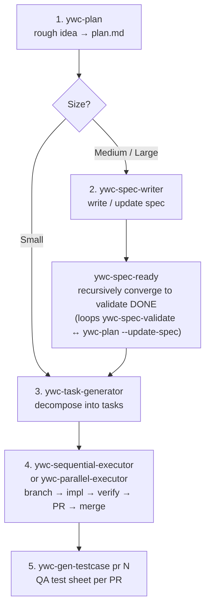

# ywc-agent-toolkit

> Este documento está siendo traducido. Consulte la documentación completa en [English](README.md).
>
> Si desea contribuir con la traducción, cree un [Translation Issue](../../issues/new?template=translation.md).

---

Colección de skills para **Claude Code** y **Codex** que automatiza el flujo de trabajo de desarrollo completo — desde la planificación y escritura de especificaciones hasta la generación de código, revisión y lanzamiento.

Actualmente incluye 41 skills para Claude Code, 41 skills para Codex, 12 agentes de Claude Code y 7 custom agents de Codex.

## Prerrequisitos

La instalación mediante marketplace de plugins y plugins de Codex **no tiene prerrequisitos** — la herramienta lo gestiona todo automáticamente.

Para el **script bash fallback**, lo siguiente debe estar instalado antes de ejecutar `install.sh`:

| Herramienta | Necesario para | Instalación |
| ----------- | -------------- | ----------- |
| `git` | Clonar el repositorio | Preinstalado en la mayoría de sistemas |
| `bash ≥ 3.2` | Ejecutar `install.sh` | Preinstalado en macOS / Linux |
| `jq` | Registro de hooks | `brew install jq` / `apt-get install jq` |

En **tiempo de ejecución de skills** (no requerido para la instalación):

| Herramienta | Utilizado por | Instalación |
| ----------- | ------------- | ----------- |
| `python3 ≥ 3.9` | Helpers de runtime de skills: `ywc-parallel-executor`, `ywc-finish-branch`, `ywc-merge-dependabot`; los hooks de Claude Code requieren Python ≥ 3.11 | Preinstalado en macOS 12.3+; `brew install python3` |
| `gh` CLI | Skills/modos basados en PR y releases de GitHub: `ywc-handle-pr-reviews`, `ywc-spec-writer --from-pr/--from-prs`, `ywc-release-pr-list`, `ywc-create-pr`, modo PR de `ywc-finish-branch`, `ywc-merge-dependabot`, `ywc-sequential-executor`/`ywc-parallel-executor`, `ywc-gen-testcase` | `brew install gh` / [cli.github.com](https://cli.github.com) |

---

## Instalación

### Marketplace de plugins de Claude Code (recomendado)

```bash
# Añadir como fuente de marketplace (una sola vez)
/plugin marketplace add yongwoon/ywc-agent-toolkit
```

Después de ejecutar el comando, abra la pestaña **Marketplaces** en el Plugin UI e instale **ywc-agent-toolkit** desde allí.
Las skills se instalan automáticamente en `~/.claude/skills/` sin necesidad de clonar ni ejecutar bash.

### Directorio de plugins de Codex CLI

Este repositorio sigue el mismo patrón de empaquetado multi-harness que proyectos como Superpowers: los metadatos de Claude Code viven en [`.claude-plugin/`](.claude-plugin/), mientras que los metadatos de Codex viven en [`.codex-plugin/`](.codex-plugin/). La fuente de verdad de Codex es [codex/skills](codex/skills). El catálogo de marketplace de Codex con alcance de repositorio en [`.agents/plugins/marketplace.json`](.agents/plugins/marketplace.json) expone el paquete generado `plugins/ywc-agent-toolkit`; su directorio `skills/` se produce desde `codex/skills` con `bash scripts/sync-codex-plugin.sh` y se verifica con `bash scripts/validate.sh`.

Esto permite instalar `ywc-agent-toolkit` desde Codex después de añadir este repositorio como fuente de marketplace de plugins, pero no implica que esté listado en el marketplace oficial curado por OpenAI.

Añada este repositorio como fuente de marketplace de plugins de Codex:

```bash
codex plugin marketplace add yongwoon/ywc-agent-toolkit
```

Si el marketplace ya estaba añadido, actualice primero su snapshot de Git:

```bash
codex plugin marketplace upgrade ywc-agent-toolkit
```

Luego instale directamente desde el marketplace configurado:

```bash
codex plugin add ywc-agent-toolkit@ywc-agent-toolkit
```

O abra el directorio de plugins:

```text
codex
/plugins
```

Dentro de la sesión interactiva de Codex, elija la pestaña de marketplace **YWC Agent Toolkit**, busque **ywc-agent-toolkit** y seleccione **Install plugin**.

### Barra lateral Plugins de Codex App

En Codex App, abra **Plugins** desde la barra lateral, elija la fuente **YWC Agent Toolkit**, busque o explore **ywc-agent-toolkit**, confirme que la fuente del plugin sea `yongwoon/ywc-agent-toolkit` e instálelo desde la vista de detalles del plugin.

Si la instalación de fuentes de marketplace no está disponible en su entorno, use el fallback bash de abajo.

### Flujo de mantenimiento para skills de Codex

Edite las skills de Codex en [codex/skills](codex/skills). No edite `plugins/ywc-agent-toolkit/skills` como fuente primaria; es el generated marketplace package usado por `codex plugin add`.

Instale una vez los Git hooks del repositorio para mantener sincronizado automáticamente el Codex marketplace package:

```bash
bash scripts/install-git-hooks.sh
```

Con los hooks instalados, los commits que tengan cambios staged en `codex/skills` ejecutan `bash scripts/sync-codex-plugin.sh`, stagean automáticamente el generated package `plugins/ywc-agent-toolkit` y luego ejecutan `bash scripts/validate.sh`. Los pushes que incluyan cambios de Codex skill/package también ejecutan el stale-package check y la validación.

Si los hooks no están instalados, ejecute manualmente los mismos comandos antes del commit:

```bash
bash scripts/sync-codex-plugin.sh
bash scripts/validate.sh
```

El bash fallback (`bash scripts/install.sh --codex`) instala directamente desde `codex/skills`. El marketplace flow (`codex plugin add ywc-agent-toolkit@ywc-agent-toolkit`) instala desde el generated package `plugins/ywc-agent-toolkit`.

### Script bash fallback

```bash
YWC_REF=<release-tag-or-reviewed-commit>
git clone --branch "$YWC_REF" --depth 1 https://github.com/yongwoon/ywc-agent-toolkit.git
cd ywc-agent-toolkit
git remote get-url origin
git rev-parse --verify HEAD

# Claude Code
bash scripts/install.sh --cc

# Codex
bash scripts/install.sh --codex

# Ambos
bash scripts/install.sh --all
```

Consulte [README.md](README.md) para más detalles.

---

## Skills

### Planificación y especificación

| Skill | Descripción |
| ----- | ----------- |
| [`ywc-plan`](claude-code/skills/ywc-plan/README.md) | Convierte una idea inicial en `plan.md` (Small) o en un documento de especificación (Medium/Large) |
| [`ywc-spec-writer`](claude-code/skills/ywc-spec-writer/README.md) | Escribe y actualiza documentos de especificación (`docs/specification/`) |
| [`ywc-spec-validate`](claude-code/skills/ywc-spec-validate/README.md) | Valida la calidad de la especificación (Completeness / Consistency / Feasibility) |
| [`ywc-tech-research`](claude-code/skills/ywc-tech-research/README.md) | Investiga librerías y compara enfoques técnicos |
| [`ywc-ubiquitous-language`](claude-code/skills/ywc-ubiquitous-language/README.md) | Crea y mantiene un diccionario de ubiquitous language del dominio |
| [`ywc-project-mission`](claude-code/skills/ywc-project-mission/README.md) | Persiste la Mission / Success Criteria / Out-of-Scope duradera del proyecto en `docs/project-mission.md` (ywc-plan lo lee para enmarcar la planificación) |
| [`ywc-brainstorm`](claude-code/skills/ywc-brainstorm/README.md) | Da forma a ideas iniciales antes de escribir un plan o una especificación formal |
| [`ywc-confidence-gate`](claude-code/skills/ywc-confidence-gate/README.md) | Comprueba preparación y riesgo antes de iniciar una implementación sustancial |
| [`ywc-onboard-repo`](claude-code/skills/ywc-onboard-repo/README.md) | Genera contexto de onboarding para repositorios desconocidos |
| [`ywc-spec-ready`](claude-code/skills/ywc-spec-ready/README.md) | Hace converger recursivamente una spec hasta ywc-spec-validate DONE (bucle validate ↔ ywc-plan --update-spec, máximo 5 iteraciones por defecto) |

---

## Modo de salida HTML para Review Skills

Nueve skills de revisión y reporte soportan un flag opt-in `--format html` que genera un informe HTML autocontenido y listo para el navegador, en lugar de Markdown.

**Skills compatibles:** `ywc-impl-review`, `ywc-security-audit`, `ywc-spec-validate`, `ywc-tech-research`, `ywc-incident-postmortem`, `ywc-product-review`, `ywc-ui-ux-review`, `ywc-gen-testcase`, `ywc-design-renew`

**Motivación:** Los documentos Markdown de más de ~100 líneas generados por IA raramente se leen de principio a fin — un informe que nadie lee no puede impulsar una decisión. HTML añade color, codificación de severidad, pestañas y controles interactivos (casillas, `Copy as Markdown`), para que quien lo recibe realmente lo lea y actúe en consecuencia.

```bash
/ywc-impl-review --spec docs/spec.md --code src/ --format html
/ywc-gen-testcase 250 --format html   # hoja de pruebas interactiva con sign-off en localStorage
```

> **⚠️ Coste en tokens** — La salida HTML consume 2-4× más tokens de salida que Markdown y tarda más en generarse. El valor predeterminado es `markdown`; active HTML solo para informes que un humano leerá en un navegador.

---

## Agentes personalizados

Claude Code incluye **12 agentes** personalizados para worker, reviewer y specialist dispatch. Se instalan en `~/.claude/agents/` y están documentados en [`claude-code/agents/README.md`](claude-code/agents/README.md).

Codex incluye **7 agentes** especialistas de solo lectura que complementan los skills `ywc-*`. Se instalan en `~/.codex/agents/`.

| Agente | Propósito | Sandbox |
|--------|-----------|---------|
| `ywc-architect` | Asesor de decisiones arquitectónicas y trade-offs | `read-only` |
| `ywc-security-engineer` | Revisión estática de seguridad y clasificación de threat model | `read-only` |
| `ywc-root-cause-analyst` | Análisis de causa raíz e incidentes | `read-only` |
| `ywc-performance-engineer` | Revisión de rendimiento y recomendaciones de profiling | `read-only` |
| `ywc-typescript-reviewer` | Revisión específica de TypeScript / JavaScript | `read-only` |
| `ywc-python-reviewer` | Revisión específica de Python | `read-only` |
| `ywc-go-reviewer` | Revisión específica de Go | `read-only` |

## Pipeline de desarrollo recomendado

Esta spine refleja cómo se invocan realmente los skills en el día a día, no el catálogo completo. Una pasada de planificación, una puerta de convergencia recursiva de spec (`ywc-spec-ready`), descomposición en tasks, y luego el executor como caballo de batalla — para cada task entrega de extremo a extremo mediante `ywc-finish-branch`, integrando la review de conformidad (`--review`), la creación de PR, el manejo de bot review y el merge como sub-pasos, de modo que rara vez se ejecutan de forma aislada en el flujo basado en tasks.



```bash
# Step 4 example — run a task range with full delivery:
ywc-sequential-executor 000020-010..000025-010 --review --base-branch <feature>
# common flags: --base-branch · --draft · --local-merge · --review · --per-task-pr
# (ywc-parallel-executor is the worktree-isolated alternative)
```

**Los cambios ad-hoc / no basados en tasks** omiten el executor y se entregan manualmente: `ywc-create-pr` abre un draft PR, y luego `ywc-handle-pr-reviews` lleva la review de bot / humana hasta green. `ywc-handle-pr-reviews` es también lo que se vuelve a ejecutar cada vez que llegan nuevos review comments a un PR abierto — sea basado en tasks o no.

También se usan en el trabajo real: `ywc-ubiquitous-language` (glosario de dominio, antes o durante la spec), y al momento del release `ywc-release-pr-list` + `ywc-changelog-release-notes`.

Los skills restantes son situacionales, no forman parte de cada ejecución — `ywc-debug-rootcause` (falla un test o build y la causa no está clara), `ywc-tdd-ritual` (red-green-refactor estricto), `ywc-tech-research` (comparar enfoques antes de decidir), `ywc-impl-review` (review de conformidad independiente fuera del executor), `ywc-spec-validate` (una review de spec puntual fuera del loop de `ywc-spec-ready`), y otros en la tabla de [Skills](#skills) anterior.

### Other pipelines

Más allá de la spine por task, algunos flujos multi-skill son secuencias diseñadas de primera clase:

**Autónomo — goal → code en un solo comando.** `ywc-agentic` convierte un único goal en code entregado, orquestando `ywc-plan → ywc-spec-validate → ywc-task-generator → executor → ywc-impl-review` en un loop Plan → Execute → Evaluate → Repeat. Replanifica ante un fallo de review y se detiene en un límite de iteraciones definido por el usuario — recúrralo en lugar de conducir la spine a mano.

**Defect → causa raíz → prevención (harness-feedback loop).** Cuando aparece un bug o un test que falla, `ywc-debug-rootcause` lo lleva hasta la causa raíz; una clase de causa recurrente se ofrece entonces a `ywc-review-learnings`, que `ywc-impl-review` y `ywc-design-renew` leen en cada review posterior — de modo que un defect confirmado refuerza las reviews futuras. `ywc-incident-postmortem` alimenta el mismo loop tras un incidente en producción.

**Persistencia de misión.** `ywc-brainstorm` da forma a una idea preliminar y ofrece persistir la intención duradera — Mission / Success Criteria / Out-of-Scope — mediante `ywc-project-mission`; `ywc-plan` lee ese archivo para enmarcar cada pasada de planificación posterior. La intención se captura una vez y se reutiliza entre features.

**Configuración de codebase nuevo.** Para un proyecto greenfield, `ywc-project-scaffold` establece la estructura de directorios y `ywc-ubiquitous-language` siembra el glosario de dominio; para un repo existente desconocido, `ywc-onboard-repo` genera el contexto de onboarding antes del primer `ywc-plan`.

Consulte [README.md](README.md) para más detalles.
