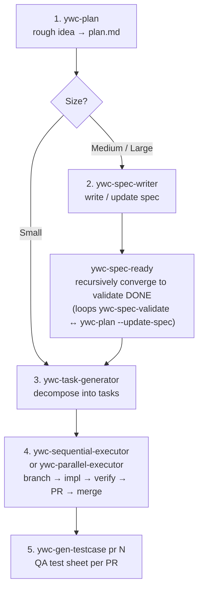

# ywc-agent-toolkit

> この文書は現在翻訳中です。完全なドキュメントは [English](README.md) をご覧ください。
>
> 翻訳にご協力いただける方は [Translation Issue](../../issues/new?template=translation.md) を作成してください。

---

Claude Code および Codex 向けの開発ワークフロー自動化スキル集です。
計画立案・仕様書作成・タスク分解・コード生成・レビュー・リリースまでをカバーします。

現在、Claude Code skill 41 個、Codex skill 41 個、Claude Code agent 12 個、Codex custom agent 7 個を提供しています。

## 前提条件

プラグインマーケットプレイスおよび Codex プラグインのインストールには **前提条件なし** — ツールがすべて自動処理します。

**bash スクリプト fallback** を使用する場合、`install.sh` を実行する前に以下が必要です:

| ツール | 必要な理由 | インストール |
| ------ | ---------- | ------------ |
| `git` | リポジトリのクローン | ほとんどのシステムにプリインストール済み |
| `bash ≥ 3.2` | `install.sh` の実行 | macOS / Linux にプリインストール済み |
| `jq` | フック登録 | `brew install jq` / `apt-get install jq` |

**スキルランタイム**（インストール時には不要）:

| ツール | 使用スキル | インストール |
| ------ | ---------- | ------------ |
| `python3 ≥ 3.9` | スキルランタイムの補助処理: `ywc-parallel-executor`, `ywc-finish-branch`, `ywc-merge-dependabot`; Claude Code hooks は Python ≥ 3.11 が必要 | macOS 12.3+ にプリインストール済み; `brew install python3` |
| `gh` CLI | PR ベースおよび GitHub release のスキル/モード: `ywc-handle-pr-reviews`, `ywc-spec-writer --from-pr/--from-prs`, `ywc-release-pr-list`, `ywc-create-pr`, `ywc-finish-branch` の PR モード, `ywc-merge-dependabot`, `ywc-sequential-executor`/`ywc-parallel-executor`, `ywc-gen-testcase` | `brew install gh` / [cli.github.com](https://cli.github.com) |

---

## インストール

### Claude Code プラグインマーケットプレイス（推奨）

```bash
# マーケットプレイスソースを追加（初回のみ）
/plugin marketplace add yongwoon/ywc-agent-toolkit
```

コマンド実行後、Plugin UI の **Marketplaces** タブから **ywc-agent-toolkit** をインストールしてください。
クローンや bash 不要で `~/.claude/skills/` に自動インストールされます。

### Codex CLI プラグインディレクトリ

このリポジトリは Superpowers と同じ multi-harness packaging pattern に従います。Claude Code のメタデータは [`.claude-plugin/`](.claude-plugin/) に、Codex のメタデータは [`.codex-plugin/`](.codex-plugin/) に分離されています。Codex の source of truth は [codex/skills](codex/skills) です。リポジトリスコープの Codex marketplace catalog である [`.agents/plugins/marketplace.json`](.agents/plugins/marketplace.json) は generated plugin package の `plugins/ywc-agent-toolkit` を公開し、その `skills/` ディレクトリは `bash scripts/sync-codex-plugin.sh` が `codex/skills` から生成し、`bash scripts/validate.sh` で鮮度が検証されます。

このリポジトリを Codex plugin marketplace source として追加すると Codex から `ywc-agent-toolkit` をインストールできますが、公式 OpenAI-curated marketplace に掲載されていることを意味しません。

このリポジトリを Codex plugin marketplace source として追加してください:

```bash
codex plugin marketplace add yongwoon/ywc-agent-toolkit
```

すでに marketplace を追加済みの場合は、先に Git snapshot を更新してください:

```bash
codex plugin marketplace upgrade ywc-agent-toolkit
```

その後、設定済み marketplace から直接インストールします:

```bash
codex plugin add ywc-agent-toolkit@ywc-agent-toolkit
```

または、プラグインディレクトリを開きます:

```text
codex
/plugins
```

対話型 Codex セッション内で **YWC Agent Toolkit** marketplace タブを選択し、**ywc-agent-toolkit** を検索して、**Install plugin** を選択してください。

### Codex App Plugins サイドバー

Codex App では、サイドバーの **Plugins** を開き、**YWC Agent Toolkit** source を選択してから **ywc-agent-toolkit** を検索または参照してください。プラグインソースが `yongwoon/ywc-agent-toolkit` であることを確認してから、プラグイン詳細画面でインストールしてください。

お使いの環境で marketplace source installation が利用できない場合は、下の bash fallback を使用してください。

### Codex skill maintenance workflow

Codex skill は [codex/skills](codex/skills) で編集してください。`plugins/ywc-agent-toolkit/skills` は `codex plugin add` が使用する generated marketplace package であり、primary source として直接編集しないでください。

Codex marketplace package を自動的に同期するため、repository Git hook を一度インストールしてください:

```bash
bash scripts/install-git-hooks.sh
```

Hook がインストールされている場合、`codex/skills` の変更が staged された commit で `bash scripts/sync-codex-plugin.sh` が実行され、generated package `plugins/ywc-agent-toolkit` が自動的に stage され、その後 `bash scripts/validate.sh` が実行されます。Codex skill/package の変更を含む push でも stale package check と validation が実行されます。

Hook をインストールしていない環境では、commit 前に同じコマンドを手動で実行してください:

```bash
bash scripts/sync-codex-plugin.sh
bash scripts/validate.sh
```

bash fallback (`bash scripts/install.sh --codex`) は `codex/skills` から直接インストールします。marketplace flow (`codex plugin add ywc-agent-toolkit@ywc-agent-toolkit`) は generated package の `plugins/ywc-agent-toolkit` からインストールします。

### bash スクリプト fallback

```bash
YWC_REF=<release-tag-or-reviewed-commit>
git clone --branch "$YWC_REF" --depth 1 https://github.com/yongwoon/ywc-agent-toolkit.git
cd ywc-agent-toolkit
git remote get-url origin
git rev-parse --verify HEAD

# Claude Code
bash scripts/install.sh --cc

# Codex
bash scripts/install.sh --codex

# 両方
bash scripts/install.sh --all
```

詳細は [README.md](README.md) をご参照ください。

---

## スキル

### Planning & Spec

| Skill | 説明 |
| ----- | ---- |
| [`ywc-plan`](claude-code/skills/ywc-plan/README.md) | ラフなアイデアを `plan.md`（Small）または Spec ドキュメント（Medium/Large）に変換します |
| [`ywc-spec-writer`](claude-code/skills/ywc-spec-writer/README.md) | Spec ドキュメント（`docs/specification/`）を作成・更新します |
| [`ywc-spec-validate`](claude-code/skills/ywc-spec-validate/README.md) | Spec の品質（Completeness / Consistency / Feasibility）を検証します |
| [`ywc-tech-research`](claude-code/skills/ywc-tech-research/README.md) | ライブラリ調査と技術アプローチの比較を行います |
| [`ywc-ubiquitous-language`](claude-code/skills/ywc-ubiquitous-language/README.md) | ドメインの ubiquitous language 辞書を作成・保守します |
| [`ywc-project-mission`](claude-code/skills/ywc-project-mission/README.md) | プロジェクトの永続的な Mission / Success Criteria / Out-of-Scope を `docs/project-mission.md` に保存します（ywc-plan が計画の枠組みに利用） |
| [`ywc-brainstorm`](claude-code/skills/ywc-brainstorm/README.md) | 正式な plan や spec を書く前にラフなアイデアを整理します |
| [`ywc-confidence-gate`](claude-code/skills/ywc-confidence-gate/README.md) | 大きめの実装を始める前に準備状況とリスクを確認します |
| [`ywc-onboard-repo`](claude-code/skills/ywc-onboard-repo/README.md) | 初見のリポジトリ向けにオンボーディング文脈を生成します |
| [`ywc-spec-ready`](claude-code/skills/ywc-spec-ready/README.md) | spec を ywc-spec-validate DONE まで再帰的に収束させます（validate ↔ ywc-plan --update-spec ループ、既定最大 5 回） |

---

## Review Skill HTML 出力モード

9 つの Review / Report skill が opt-in の `--format html` flag をサポートします。Markdown の代わりに、ブラウザでそのまま開ける self-contained な HTML report を生成します。

**対応 Skill:** `ywc-impl-review`, `ywc-security-audit`, `ywc-spec-validate`, `ywc-tech-research`, `ywc-incident-postmortem`, `ywc-product-review`, `ywc-ui-ux-review`, `ywc-gen-testcase`, `ywc-design-renew`

**導入の背景:** AI が生成した 100 行を超える Markdown ドキュメントは最後まで読まれない傾向があり、読まれない report は意思決定につながりません。HTML は色、severity coding、tab、インタラクティブな control（チェックボックス、`Copy as Markdown`）を加えることで、受け手が実際に読んで行動できるようにします。

```bash
/ywc-impl-review --spec docs/spec.md --code src/ --format html
/ywc-gen-testcase 250 --format html   # localStorage でサインオフ状態を保持するインタラクティブなテストシート
```

> **⚠️ Token コスト** — HTML 出力は Markdown と比べて output token を 2〜4 倍消費し、生成時間も長くなります。デフォルトは `markdown` です。人がブラウザで読む report に限って HTML を有効化してください。

---

## Custom Agent

Claude Code には worker / reviewer / specialist dispatch 用の **12 個**の custom agent が含まれています。`~/.claude/agents/` にインストールされます。詳細は [`claude-code/agents/README.md`](claude-code/agents/README.md) をご参照ください。

Codex には `ywc-*` skill を補完する **7 個**の read-only specialist agent が含まれます。`~/.codex/agents/` にインストールされます。

| Agent | 用途 | Sandbox |
|-------|------|---------|
| `ywc-architect` | アーキテクチャ決定・トレードオフ advisor | `read-only` |
| `ywc-security-engineer` | 静的セキュリティレビューと threat model 分類 | `read-only` |
| `ywc-root-cause-analyst` | 根本原因・障害原因の分析 | `read-only` |
| `ywc-performance-engineer` | パフォーマンスレビューとプロファイリング推奨 | `read-only` |
| `ywc-typescript-reviewer` | TypeScript / JavaScript 言語特化レビュー | `read-only` |
| `ywc-python-reviewer` | Python 言語特化レビュー | `read-only` |
| `ywc-go-reviewer` | Go 言語特化レビュー | `read-only` |

## 推奨開発 Pipeline

この spine は全 catalog ではなく、skill が日々実際に呼び出される流れを反映しています。1 回の planning pass、再帰的な spec 収束 gate（`ywc-spec-ready`）、task 分解、そして workhorse となる executor — 各 task は `ywc-finish-branch` を通じて end-to-end で配信され、適合性 review（`--review`）、PR 作成、bot review 処理、merge を sub-step として畳み込むため、task 駆動フローではこれらが単独で実行されることはほとんどありません。



```bash
# Step 4 example — run a task range with full delivery:
ywc-sequential-executor 000020-010..000025-010 --review --base-branch <feature>
# common flags: --base-branch · --draft · --local-merge · --review · --per-task-pr
# (ywc-parallel-executor is the worktree-isolated alternative)
```

**Ad-hoc / non-task の変更**は executor をスキップして手動で配信します: `ywc-create-pr` が draft PR を開き、`ywc-handle-pr-reviews` が bot / human review を green まで導きます。`ywc-handle-pr-reviews` は、open PR に新しい review comment が付くたびに（task 駆動かどうかに関わらず）再実行する skill でもあります。

実際の作業で併用されるもの: `ywc-ubiquitous-language`（spec 作成前・作成中の domain glossary）、そして release 時の `ywc-release-pr-list` + `ywc-changelog-release-notes`。

残りの skill は状況依存で、毎回実行されるわけではありません — `ywc-debug-rootcause`（test や build が失敗し原因が不明なとき）、`ywc-tdd-ritual`（厳格な red-green-refactor）、`ywc-tech-research`（決定前のアプローチ比較）、`ywc-impl-review`（executor 外の単独適合性 review）、`ywc-spec-validate`（`ywc-spec-ready` loop 外の一回限りの spec review）、その他は上記 [Skills](#スキル) 表をご参照ください。

### Other pipelines

per-task spine 以外にも、いくつかの複数 skill フローが設計された first-class な sequence として存在します:

**Autonomous — goal → code を 1 コマンドで。** `ywc-agentic` は単一の goal を配信済み code に変換し、`ywc-plan → ywc-spec-validate → ywc-task-generator → executor → ywc-impl-review` を Plan → Execute → Evaluate → Repeat loop で orchestration します。review 失敗時に re-plan し、ユーザーが設定した iteration 上限で停止します — spine を手動で動かす代わりにこれを使ってください。

**Defect → root cause → prevention（harness-feedback loop）。** bug や test 失敗が発生すると `ywc-debug-rootcause` が root cause まで追跡し、繰り返し発生する cause class は `ywc-review-learnings` に offer されます。このファイルは以降のすべての review で `ywc-impl-review` と `ywc-design-renew` が読み込むため、確認された defect が将来の review を強化します。`ywc-incident-postmortem` は production 障害後に同じ loop へ寄与します。

**Mission persistence。** `ywc-brainstorm` は大まかな idea を整え、durable な intent — Mission / Success Criteria / Out-of-Scope — を `ywc-project-mission` に保存するよう offer します。`ywc-plan` は以降のすべての planning pass の枠組みを作るためにこのファイルを読み込みます。intent は一度 capture され、複数の feature にわたって再利用されます。

**New-codebase setup。** greenfield project では `ywc-project-scaffold` が directory 構造を用意し、`ywc-ubiquitous-language` が domain glossary を seed します。既存の不慣れな repo では `ywc-onboard-repo` が最初の `ywc-plan` の前に onboarding context を生成します。

詳細は [README.md](README.md) をご参照ください。
