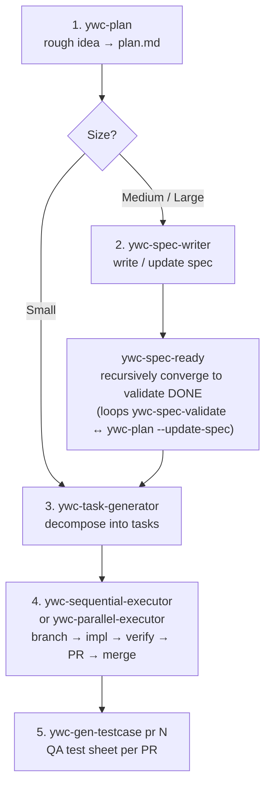

# ywc-agent-toolkit

> 本文档正在翻译中。完整文档请参阅 [English](README.md)。
>
> 欢迎帮助翻译，请创建 [Translation Issue](../../issues/new?template=translation.md)。

---

面向 Claude Code 和 Codex 的开发工作流自动化技能集合。
涵盖计划制定、规格书撰写、任务分解、代码生成、审查和发布的完整开发流程。

目前包含 41 个 Claude Code skill、41 个 Codex skill、12 个 Claude Code agent 和 7 个 Codex custom agent。

## 前提条件

插件市场和 Codex 插件安装**无需前提条件** — 工具会自动处理一切。

使用 **bash 脚本 fallback** 时，运行 `install.sh` 前需安装以下工具：

| 工具 | 用途 | 安装方式 |
| ---- | ---- | -------- |
| `git` | 克隆仓库 | 大多数系统已预装 |
| `bash ≥ 3.2` | 运行 `install.sh` | macOS / Linux 已预装 |
| `jq` | Hook 注册 | `brew install jq` / `apt-get install jq` |

**Skill 运行时**（安装时不需要）：

| 工具 | 使用的 Skill | 安装方式 |
| ---- | ------------ | -------- |
| `python3 ≥ 3.9` | Skill 运行时辅助功能：`ywc-parallel-executor`、`ywc-finish-branch`、`ywc-merge-dependabot`；Claude Code hooks 需要 Python ≥ 3.11 | macOS 12.3+ 已预装；`brew install python3` |
| `gh` CLI | 基于 PR 和 GitHub release 的 Skill/模式：`ywc-handle-pr-reviews`、`ywc-spec-writer --from-pr/--from-prs`、`ywc-release-pr-list`、`ywc-create-pr`、`ywc-finish-branch` PR 模式、`ywc-merge-dependabot`、`ywc-sequential-executor`/`ywc-parallel-executor`、`ywc-gen-testcase` | `brew install gh` / [cli.github.com](https://cli.github.com) |

---

## 安装

### Claude Code 插件市场（推荐）

```bash
# 添加市场源（仅需一次）
/plugin marketplace add yongwoon/ywc-agent-toolkit
```

运行命令后，在 Plugin UI 的 **Marketplaces** 标签页中安装 **ywc-agent-toolkit**。
无需克隆或运行 bash，自动安装到 `~/.claude/skills/`。

### Codex CLI 插件目录

本仓库采用与 Superpowers 相同的 multi-harness packaging pattern：Claude Code 元数据位于 [`.claude-plugin/`](.claude-plugin/)，Codex 元数据位于 [`.codex-plugin/`](.codex-plugin/)。Codex 的 source of truth 是 [codex/skills](codex/skills)。仓库范围的 Codex marketplace catalog [`.agents/plugins/marketplace.json`](.agents/plugins/marketplace.json) 暴露 generated plugin package `plugins/ywc-agent-toolkit`，其中的 `skills/` 目录由 `bash scripts/sync-codex-plugin.sh` 从 `codex/skills` 生成，并由 `bash scripts/validate.sh` 检查是否保持最新。

将本仓库添加为 Codex plugin marketplace source 后，可以在 Codex 中安装 `ywc-agent-toolkit`，但这不表示它已经上架到官方 OpenAI-curated marketplace。

将本仓库添加为 Codex plugin marketplace source：

```bash
codex plugin marketplace add yongwoon/ywc-agent-toolkit
```

如果之前已经添加过 marketplace，请先刷新 Git snapshot：

```bash
codex plugin marketplace upgrade ywc-agent-toolkit
```

然后从已配置的 marketplace 直接安装：

```bash
codex plugin add ywc-agent-toolkit@ywc-agent-toolkit
```

或打开插件目录：

```text
codex
/plugins
```

在交互式 Codex 会话中选择 **YWC Agent Toolkit** marketplace 标签页，搜索 **ywc-agent-toolkit**，然后选择 **Install plugin**。

### Codex App Plugins 侧边栏

在 Codex App 中，从侧边栏打开 **Plugins**，选择 **YWC Agent Toolkit** source，然后搜索或浏览 **ywc-agent-toolkit**。确认插件来源是 `yongwoon/ywc-agent-toolkit`，然后在插件详情页安装。

如果你的环境无法使用 marketplace source installation，请使用下面的 bash fallback。

### Codex skill 维护 workflow

Codex skill 请在 [codex/skills](codex/skills) 中修改。`plugins/ywc-agent-toolkit/skills` 是 `codex plugin add` 使用的 generated marketplace package，不要把它作为 primary source 直接编辑。

请先安装一次 repository Git hooks，让 Codex marketplace package 自动保持同步：

```bash
bash scripts/install-git-hooks.sh
```

安装 hooks 后，当 commit 中 staged 了 `codex/skills` 变更时，会运行 `bash scripts/sync-codex-plugin.sh`，自动 stage generated package `plugins/ywc-agent-toolkit`，然后运行 `bash scripts/validate.sh`。包含 Codex skill/package 变更的 push 也会运行 stale package check 和 validation。

如果当前环境没有安装 hooks，请在 commit 前手动运行同样的命令：

```bash
bash scripts/sync-codex-plugin.sh
bash scripts/validate.sh
```

bash fallback（`bash scripts/install.sh --codex`）会直接从 `codex/skills` 安装。marketplace flow（`codex plugin add ywc-agent-toolkit@ywc-agent-toolkit`）会从 generated package `plugins/ywc-agent-toolkit` 安装。

### bash 脚本 fallback

```bash
YWC_REF=<release-tag-or-reviewed-commit>
git clone --branch "$YWC_REF" --depth 1 https://github.com/yongwoon/ywc-agent-toolkit.git
cd ywc-agent-toolkit
git remote get-url origin
git rev-parse --verify HEAD

# Claude Code
bash scripts/install.sh --cc

# Codex
bash scripts/install.sh --codex

# 两者都安装
bash scripts/install.sh --all
```

详细说明请参阅 [README.md](README.md)。

---

## Skills

### 规划与规格

| Skill | 说明 |
| ----- | ---- |
| [`ywc-plan`](claude-code/skills/ywc-plan/README.md) | 将粗略想法转换为 `plan.md`（Small）或规格文档（Medium/Large） |
| [`ywc-spec-writer`](claude-code/skills/ywc-spec-writer/README.md) | 编写和更新规格文档（`docs/specification/`） |
| [`ywc-spec-validate`](claude-code/skills/ywc-spec-validate/README.md) | 验证规格质量（Completeness / Consistency / Feasibility） |
| [`ywc-tech-research`](claude-code/skills/ywc-tech-research/README.md) | 调研库并比较技术方案 |
| [`ywc-ubiquitous-language`](claude-code/skills/ywc-ubiquitous-language/README.md) | 创建并维护领域 ubiquitous language 词典 |
| [`ywc-project-mission`](claude-code/skills/ywc-project-mission/README.md) | 将项目长期有效的 Mission / Success Criteria / Out-of-Scope 持久化到 `docs/project-mission.md`（ywc-plan 会读取它来框定规划） |
| [`ywc-brainstorm`](claude-code/skills/ywc-brainstorm/README.md) | 在编写正式 plan 或 spec 之前整理粗略想法 |
| [`ywc-confidence-gate`](claude-code/skills/ywc-confidence-gate/README.md) | 在开始较大实现前检查准备度和风险 |
| [`ywc-onboard-repo`](claude-code/skills/ywc-onboard-repo/README.md) | 为不熟悉的仓库生成 onboarding 上下文 |
| [`ywc-spec-ready`](claude-code/skills/ywc-spec-ready/README.md) | 递归收敛 spec 到 ywc-spec-validate DONE（validate ↔ ywc-plan --update-spec 循环，默认最多 5 次迭代） |

---

## Review Skill HTML 输出模式

9 个 Review / Report skill 支持可选的 `--format html` flag，生成可直接在浏览器中打开的 self-contained HTML 报告，而非 Markdown。

**支持的 Skill：** `ywc-impl-review`、`ywc-security-audit`、`ywc-spec-validate`、`ywc-tech-research`、`ywc-incident-postmortem`、`ywc-product-review`、`ywc-ui-ux-review`、`ywc-gen-testcase`、`ywc-design-renew`

**背景：** AI 生成的超过 100 行的 Markdown 文档往往无法被完整阅读，而未被阅读的报告无法推动决策。HTML 通过颜色、severity 标记、标签页和交互控件（复选框、`Copy as Markdown`）让接收方真正阅读并采取行动。

```bash
/ywc-impl-review --spec docs/spec.md --code src/ --format html
/ywc-gen-testcase 250 --format html   # 通过 localStorage 保存签收状态的交互式测试表
```

> **⚠️ Token 成本** — HTML 输出比 Markdown 消耗 2-4 倍的 output token，生成时间也更长。默认值为 `markdown`，仅在需要人工在浏览器中阅读报告时才启用 HTML。

---

## Custom Agent

Claude Code 包含 **12 个**用于 worker、reviewer、specialist dispatch 的 custom agent，安装到 `~/.claude/agents/`，详细信息请参阅 [`claude-code/agents/README.md`](claude-code/agents/README.md)。

Codex 包含 **7 个**补充 `ywc-*` skill 的 read-only specialist agent，安装到 `~/.codex/agents/`。

| Agent | 用途 | Sandbox |
|-------|------|---------|
| `ywc-architect` | 架构决策与权衡 advisor | `read-only` |
| `ywc-security-engineer` | 静态安全审查与威胁模型分类 | `read-only` |
| `ywc-root-cause-analyst` | 根因与故障原因分析 | `read-only` |
| `ywc-performance-engineer` | 性能审查与性能分析建议 | `read-only` |
| `ywc-typescript-reviewer` | TypeScript / JavaScript 语言专项审查 | `read-only` |
| `ywc-python-reviewer` | Python 语言专项审查 | `read-only` |
| `ywc-go-reviewer` | Go 语言专项审查 | `read-only` |

## 推荐开发 Pipeline

此 spine 反映的是 skill 在日常中实际被调用的方式，而非完整 catalog。一次 planning pass、递归式 spec 收敛 gate（`ywc-spec-ready`）、task 分解，然后是作为主力的 executor — 每个 task 都通过 `ywc-finish-branch` 端到端交付，并将适合性 review（`--review`）、PR 创建、bot review 处理与 merge 折叠为 sub-step，因此在 task 驱动流程中它们很少单独运行。



```bash
# Step 4 example — run a task range with full delivery:
ywc-sequential-executor 000020-010..000025-010 --review --base-branch <feature>
# common flags: --base-branch · --draft · --local-merge · --review · --per-task-pr
# (ywc-parallel-executor is the worktree-isolated alternative)
```

**Ad-hoc / 非 task 变更**会跳过 executor 并手动交付：`ywc-create-pr` 打开 draft PR，然后 `ywc-handle-pr-reviews` 将 bot / human review 推进到 green。每当 open PR 上出现新的 review comment 时（无论是否 task 驱动），都需要重新运行 `ywc-handle-pr-reviews`。

实际工作中还会用到：`ywc-ubiquitous-language`（spec 编写前/中的 domain glossary），以及 release 时的 `ywc-release-pr-list` + `ywc-changelog-release-notes`。

其余 skill 视情况使用，并非每次都运行 — `ywc-debug-rootcause`（test 或 build 失败且原因不明时）、`ywc-tdd-ritual`（严格的 red-green-refactor）、`ywc-tech-research`（决策前比较方案）、`ywc-impl-review`（executor 之外的单独适合性 review）、`ywc-spec-validate`（`ywc-spec-ready` loop 之外的一次性 spec review），以及上方 [Skills](#skills) 表中的其他项。

### Other pipelines

除 per-task spine 之外，还有几条多 skill 流程是设计好的一等 sequence：

**Autonomous — 一条命令完成 goal → code。** `ywc-agentic` 将单个 goal 转化为已交付的 code，以 Plan → Execute → Evaluate → Repeat loop 编排 `ywc-plan → ywc-spec-validate → ywc-task-generator → executor → ywc-impl-review`。它在 review 失败时 re-plan，并在用户设定的 iteration 上限处停止 — 与其手动驱动 spine，不如使用它。

**Defect → root cause → prevention（harness-feedback loop）。** 当出现 bug 或 test 失败时，`ywc-debug-rootcause` 将其追踪至 root cause；反复出现的 cause class 会被 offer 给 `ywc-review-learnings`，而 `ywc-impl-review` 与 `ywc-design-renew` 会在之后的每次 review 中读取该文件 — 因此一个已确认的 defect 会强化未来的 review。`ywc-incident-postmortem` 在 production 事故后向同一 loop 提供输入。

**Mission persistence。** `ywc-brainstorm` 梳理粗略的 idea，并 offer 通过 `ywc-project-mission` 持久化 durable 的 intent — Mission / Success Criteria / Out-of-Scope；`ywc-plan` 会读取该文件来为之后的每次 planning pass 设定框架。intent 一次捕获，可在多个 feature 间复用。

**New-codebase setup。** 对于 greenfield project，`ywc-project-scaffold` 搭建 directory 结构，`ywc-ubiquitous-language` 为 domain glossary 播种；对于已有的陌生 repo，`ywc-onboard-repo` 会在首次 `ywc-plan` 之前生成 onboarding context。

详细信息请参阅 [README.md](README.md)。
