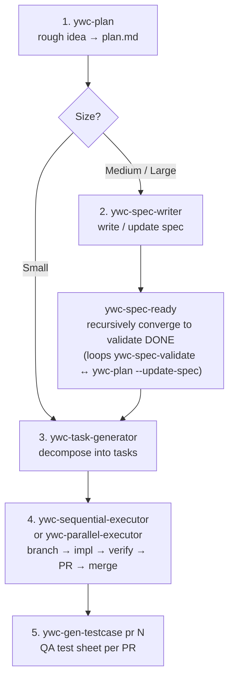

# ywc-agent-toolkit

A collection of skills for **Claude Code** and **Codex** that automates the full development workflow — from planning and spec writing to code generation, review, and release.

[한국어](../../README.ko.md) | [中文](../../README.zh.md) | [日本語](../../README.ja.md) | [Español](../../README.es.md)

## Supported Tools

| Tool        | Skills | Custom Agents | Install path                             |
| ----------- | ------ | ------------- | ---------------------------------------- |
| Claude Code | 41     | 12            | `~/.claude/skills/`, `~/.claude/agents/` |
| Codex       | 41     | 7             | `~/.codex/skills/`, `~/.codex/agents/`   |

## Prerequisites

Plugin marketplace and Codex plugin installation have **no prerequisites** — the tool handles everything automatically.

For the **bash script fallback**, the following must be installed before running `install.sh`:

| Tool | Required for | Install |
| ---- | ------------ | ------- |
| `git` | Cloning the repository | Pre-installed on most systems |
| `bash ≥ 3.2` | Running `install.sh` | Pre-installed on macOS / Linux |
| `jq` | Hook registration | `brew install jq` / `apt-get install jq` |

At **skill runtime** (not required for installation):

| Tool | Used by | Install |
| ---- | ------- | ------- |
| `python3 ≥ 3.9` | Skill runtime helpers: `ywc-parallel-executor`, `ywc-finish-branch`, `ywc-merge-dependabot`; Claude Code hooks require Python ≥ 3.11 | Pre-installed on macOS 12.3+; `brew install python3` |
| `gh` CLI | PR-based and GitHub release skills/modes: `ywc-handle-pr-reviews`, `ywc-spec-writer --from-pr/--from-prs`, `ywc-release-pr-list`, `ywc-create-pr`, `ywc-finish-branch` PR mode, `ywc-merge-dependabot`, `ywc-sequential-executor`/`ywc-parallel-executor`, `ywc-gen-testcase` | `brew install gh` / [cli.github.com](https://cli.github.com) |

---

## Installation

### Via Claude Code plugin marketplace (recommended)

```bash
# Add as a marketplace source (one-time setup)
/plugin marketplace add yongwoon/ywc-agent-toolkit
```

After running the command, open the Plugin UI (**Marketplaces** tab) and install **ywc-agent-toolkit** from there.
Skills and Claude Code agents are installed automatically — no cloning or bash required.

### Via Codex CLI plugin directory

This repository follows the same multi-harness packaging pattern used by projects such as Superpowers: Claude Code metadata lives under [`.claude-plugin/`](../../.claude-plugin/), while Codex metadata lives under [`.codex-plugin/`](../../.codex-plugin/). The Codex source of truth is [codex/skills](../../codex/skills). The repo-scoped Codex marketplace catalog at [`.agents/plugins/marketplace.json`](../../.agents/plugins/marketplace.json) exposes a generated plugin package at `plugins/ywc-agent-toolkit`, whose `skills/` directory is produced from `codex/skills` by `bash scripts/sync-codex-plugin.sh` and checked by `bash scripts/validate.sh`.

This makes `ywc-agent-toolkit` installable from Codex after adding this repository as a plugin marketplace source, but does not mean it is listed in the official OpenAI-curated marketplace.

Add this repository as a Codex plugin marketplace source:

```bash
codex plugin marketplace add yongwoon/ywc-agent-toolkit
```

If the marketplace was already added, refresh its Git snapshot first:

```bash
codex plugin marketplace upgrade ywc-agent-toolkit
```

Then install directly from the configured marketplace:

```bash
codex plugin add ywc-agent-toolkit@ywc-agent-toolkit
```

Or open the plugin directory:

```text
codex
/plugins
```

Inside the interactive Codex session, choose the **YWC Agent Toolkit** marketplace tab, search for **ywc-agent-toolkit**, then choose **Install plugin**.

### Via Codex App Plugins sidebar

In the Codex App, open **Plugins** from the sidebar, choose the **YWC Agent Toolkit** source, search or browse for **ywc-agent-toolkit**, confirm the plugin source is `yongwoon/ywc-agent-toolkit`, then install it from the plugin details view.

If marketplace source installation is unavailable in your environment, use the bash fallback below.

### Maintainer workflow for Codex skills

Edit Codex skills in [codex/skills](../../codex/skills). Do not edit `plugins/ywc-agent-toolkit/skills` as the primary source; it is the generated marketplace package used by `codex plugin add`.

Install repository Git hooks once so Codex marketplace packaging stays in sync automatically:

```bash
bash scripts/install-git-hooks.sh
```

With the hooks installed, commits that stage `codex/skills` changes run `bash scripts/sync-codex-plugin.sh`, stage the generated `plugins/ywc-agent-toolkit` package, and then run `bash scripts/validate.sh`. Pushes that include Codex skill or package changes also run the stale-package check and validation.

If hooks are not installed, run the same commands manually before committing:

```bash
bash scripts/sync-codex-plugin.sh
bash scripts/validate.sh
```

The bash fallback (`bash scripts/install.sh --codex`) installs directly from `codex/skills`. The marketplace flow (`codex plugin add ywc-agent-toolkit@ywc-agent-toolkit`) installs from the generated `plugins/ywc-agent-toolkit` package.

### Via bash script fallback

```bash
YWC_REF=<release-tag-or-reviewed-commit>
git clone --branch "$YWC_REF" --depth 1 https://github.com/yongwoon/ywc-agent-toolkit.git
cd ywc-agent-toolkit
git remote get-url origin
git rev-parse --verify HEAD

# Claude Code
bash scripts/install.sh --cc

# Codex
bash scripts/install.sh --codex

# Both
bash scripts/install.sh --all
```

### Install specific skills only

```bash
bash scripts/install.sh --cc ywc-plan ywc-commit ywc-create-pr
bash scripts/install.sh --codex ywc-plan ywc-commit ywc-ui-ux-review
```

### Install only custom agents

```bash
# All 12 Claude Code worker/reviewer/specialist agents
bash scripts/install.sh --cc-agents

# All 7 read-only specialist agents
bash scripts/install.sh --codex-agents

# Selected agents
bash scripts/install.sh --cc-agents ywc-backend-coder ywc-qa-engineer
bash scripts/install.sh --codex-agents ywc-security-engineer ywc-architect

# Skills only, leaving agents untouched
bash scripts/install.sh --cc --skip-agents
bash scripts/install.sh --codex --skip-agents
```

### List available items

```bash
bash scripts/install.sh --list
bash scripts/install.sh --list --cc
bash scripts/install.sh --list --codex
bash scripts/install.sh --list --cc-agents
bash scripts/install.sh --list --codex-agents
```

### Environment variables

| Variable            | Default            | Description                             |
| ------------------- | ------------------ | --------------------------------------- |
| `CLAUDE_SKILLS_DIR` | `~/.claude/skills` | Override Claude Code install path       |
| `CLAUDE_AGENTS_DIR` | `~/.claude/agents` | Override Claude Code agent install path |
| `CODEX_HOME`        | `~/.codex`         | Override Codex home path                |

Restart Claude Code or Codex after installation for skills to take effect.

---

## Quick Start

Install via the Claude Code plugin marketplace — no cloning or bash required:

```bash
/plugin marketplace add yongwoon/ywc-agent-toolkit
```

Then invoke any skill immediately inside Claude Code:

```bash
/ywc-onboard-repo           # understand an unfamiliar codebase in minutes
/ywc-plan                   # turn a rough idea into a plan or spec
/ywc-debug-rootcause        # trace a bug to its root cause
/ywc-impl-review            # review code for spec / security / quality
/ywc-agentic                # run the full pipeline autonomously from a goal
```

Not sure which skill to use? → [What do I want to do?](#what-do-i-want-to-do)

---

## Skills

Most `ywc-*` skills are available for both Claude Code and Codex. The Codex
versions include Codex-compatible frontmatter and tool guidance.

### What do I want to do?

| Goal | Skills |
| ---- | ------ |
| Turn an idea into a plan or spec | [`ywc-plan`](../../claude-code/skills/ywc-plan/README.md) → [`ywc-spec-writer`](../../claude-code/skills/ywc-spec-writer/README.md) |
| Understand an unfamiliar codebase | [`ywc-onboard-repo`](../../claude-code/skills/ywc-onboard-repo/README.md) |
| Break work into dependency-safe tasks | [`ywc-task-generator`](../../claude-code/skills/ywc-task-generator/README.md) |
| Implement tasks end-to-end | [`ywc-sequential-executor`](../../claude-code/skills/ywc-sequential-executor/README.md) / [`ywc-parallel-executor`](../../claude-code/skills/ywc-parallel-executor/README.md) |
| Run the full pipeline from a goal | [`ywc-agentic`](../../claude-code/skills/ywc-agentic/README.md) |
| Find the root cause of a bug | [`ywc-debug-rootcause`](../../claude-code/skills/ywc-debug-rootcause/README.md) |
| Review code quality and security | [`ywc-impl-review`](../../claude-code/skills/ywc-impl-review/README.md), [`ywc-security-audit`](../../claude-code/skills/ywc-security-audit/README.md) |
| Open a PR and handle review comments | [`ywc-create-pr`](../../claude-code/skills/ywc-create-pr/README.md) → [`ywc-handle-pr-reviews`](../../claude-code/skills/ywc-handle-pr-reviews/README.md) |
| Generate a QA test sheet | [`ywc-gen-testcase`](../../claude-code/skills/ywc-gen-testcase/README.md) |
| Write release notes | [`ywc-release-pr-list`](../../claude-code/skills/ywc-release-pr-list/README.md) + [`ywc-changelog-release-notes`](../../claude-code/skills/ywc-changelog-release-notes/README.md) |
| Author a new `ywc-*` skill | [`ywc-skill-author`](../../claude-code/skills/ywc-skill-author/README.md) |

### Planning & Spec

| Skill | Description |
| ----- | ----------- |
| [`ywc-plan`](../../claude-code/skills/ywc-plan/README.md) | Convert a rough idea into `plan.md` (Small) or a Spec document (Medium/Large) |
| [`ywc-spec-writer`](../../claude-code/skills/ywc-spec-writer/README.md) | Write and update spec documents (`docs/specification/`) |
| [`ywc-spec-validate`](../../claude-code/skills/ywc-spec-validate/README.md) | Validate spec quality (Completeness / Consistency / Feasibility) |
| [`ywc-tech-research`](../../claude-code/skills/ywc-tech-research/README.md) | Research libraries and compare technical approaches |
| [`ywc-ubiquitous-language`](../../claude-code/skills/ywc-ubiquitous-language/README.md) | Create and maintain a domain ubiquitous language dictionary |
| [`ywc-project-mission`](../../claude-code/skills/ywc-project-mission/README.md) | Persist the project's durable Mission / Success Criteria / Out-of-Scope in `docs/project-mission.md` (read by ywc-plan to frame planning) |
| [`ywc-brainstorm`](../../claude-code/skills/ywc-brainstorm/README.md) | Shape rough ideas before writing a formal plan or spec |
| [`ywc-confidence-gate`](../../claude-code/skills/ywc-confidence-gate/README.md) | Check readiness and risk before starting substantial implementation |
| [`ywc-onboard-repo`](../../claude-code/skills/ywc-onboard-repo/README.md) | Generate repository onboarding context for unfamiliar projects |
| [`ywc-spec-ready`](../../claude-code/skills/ywc-spec-ready/README.md) | Recursively converge a spec to ywc-spec-validate DONE (validate ↔ ywc-plan --update-spec loop, default max 5 iterations) |

### Task & Execution

| Skill | Description |
| ----- | ----------- |
| [`ywc-task-generator`](../../claude-code/skills/ywc-task-generator/README.md) | Decompose a spec into dependency-safe tasks |
| [`ywc-sequential-executor`](../../claude-code/skills/ywc-sequential-executor/README.md) | Execute tasks sequentially (Branch → Implement → Commit → PR → Merge) |
| [`ywc-parallel-executor`](../../claude-code/skills/ywc-parallel-executor/README.md) | Execute tasks in parallel using Git worktree isolation |
| [`ywc-code-gen`](../../claude-code/skills/ywc-code-gen/README.md) | Generate Backend + Frontend + QA code in parallel |
| [`ywc-agentic`](../../claude-code/skills/ywc-agentic/README.md) | Autonomously orchestrate the ywc-\* pipeline from a goal (Plan → Execute → Evaluate → Repeat, max 3 iterations) |
| [`ywc-tdd-ritual`](../../claude-code/skills/ywc-tdd-ritual/README.md) | Drive feature and bugfix work through a red-green-refactor loop |
| [`ywc-worktrees`](../../claude-code/skills/ywc-worktrees/README.md) | Create, audit, prune, and resolve worktree-based task isolation |
| [`ywc-docker-isolate`](../../claude-code/skills/ywc-docker-isolate/README.md) | Deterministically isolate per-worktree Docker host ports for parallel runs (setup / teardown / audit) |

### Review & Verification

| Skill | Description |
| ----- | ----------- |
| [`ywc-impl-review`](../../claude-code/skills/ywc-impl-review/README.md) | Verify implementation across Architecture / Design / Devex / Security / QA axes |
| [`ywc-review-learnings`](../../claude-code/skills/ywc-review-learnings/README.md) | Accumulate per-project review preferences in `docs/review-learnings.md` |
| [`ywc-security-audit`](../../claude-code/skills/ywc-security-audit/README.md) | Security audit based on OWASP Top 10 |
| [`ywc-ui-ux-review`](../../claude-code/skills/ywc-ui-ux-review/README.md) | UI/UX review (IA + Visual design + WCAG 2.2 AA) |
| [`ywc-design-renew`](../../claude-code/skills/ywc-design-renew/README.md) | Renew generic UI surfaces and audit AI-slop design tells |
| [`ywc-product-review`](../../claude-code/skills/ywc-product-review/README.md) | Product feedback across 5 business dimensions |
| [`ywc-gen-testcase`](../../claude-code/skills/ywc-gen-testcase/README.md) | Generate test sheets from PRs or tasks |
| [`ywc-e2e-test-strategy`](../../claude-code/skills/ywc-e2e-test-strategy/README.md) | Design Playwright E2E test strategy |
| [`ywc-debug-rootcause`](../../claude-code/skills/ywc-debug-rootcause/README.md) | Investigate bugs, failed tests, and build failures to the root cause |
| [`ywc-receive-review`](../../claude-code/skills/ywc-receive-review/README.md) | Triage and apply human or automated review feedback |
| [`ywc-refactor-clean`](../../claude-code/skills/ywc-refactor-clean/README.md) | Remove dead code, unused exports, stale files, and unused dependencies |
| [`ywc-verify-done`](../../claude-code/skills/ywc-verify-done/README.md) | Verify tests, builds, and completion evidence before declaring work done |

### Git & Release

| Skill | Description |
| ----- | ----------- |
| [`ywc-commit`](../../claude-code/skills/ywc-commit/README.md) | Stage and commit session work |
| [`ywc-create-pr`](../../claude-code/skills/ywc-create-pr/README.md) | Commit and create a Draft PR |
| [`ywc-handle-pr-reviews`](../../claude-code/skills/ywc-handle-pr-reviews/README.md) | Automate PR review responses |
| [`ywc-finish-branch`](../../claude-code/skills/ywc-finish-branch/README.md) | Full branch delivery (CI → merge → cleanup) |
| [`ywc-merge-dependabot`](../../claude-code/skills/ywc-merge-dependabot/README.md) | Auto-merge Dependabot PRs |
| [`ywc-release-pr-list`](../../claude-code/skills/ywc-release-pr-list/README.md) | Summarize PRs included in a release |
| [`ywc-changelog-release-notes`](../../claude-code/skills/ywc-changelog-release-notes/README.md) | Generate CHANGELOG entries and user-facing release notes |

### Documentation & Other

| Skill | Description |
| ----- | ----------- |
| [`ywc-project-scaffold`](../../claude-code/skills/ywc-project-scaffold/README.md) | Generate directory structure for any language/framework |
| [`ywc-project-docs`](../../claude-code/skills/ywc-project-docs/README.md) | Generate project documentation in Korean or Japanese |
| [`ywc-incident-postmortem`](../../claude-code/skills/ywc-incident-postmortem/README.md) | Write a structured postmortem after a production incident |
| [`ywc-skill-author`](../../claude-code/skills/ywc-skill-author/README.md) | (Meta) Rules for authoring new `ywc-*` skills |

### Codex-only

| Skill | Description |
| ----- | ----------- |
| `ywc-team-assemble` | Split explicitly authorized work across specialist Codex subagents |

---

## Custom Agents

Claude Code also ships 12 custom agents for worker, reviewer, and specialist dispatch. They install to `~/.claude/agents/` and are documented in [`claude-code/agents/README.md`](../../claude-code/agents/README.md).

Seven read-only specialist agents complement the `ywc-*` skills. They are installed to `~/.codex/agents/` (override with `CODEX_HOME`) as individual TOML files, and Codex loads one custom agent per file.

| Agent | Purpose | Sandbox |
| ----- | ------- | ------- |
| [`ywc-architect`](../../claude-code/agents/ywc-architect.md) | Architectural decision and trade-off advisor | `read-only` |
| [`ywc-security-engineer`](../../claude-code/agents/ywc-security-engineer.md) | Static security review and threat-model triage | `read-only` |
| [`ywc-root-cause-analyst`](../../claude-code/agents/ywc-root-cause-analyst.md) | Root-cause and incident-cause analysis | `read-only` |
| [`ywc-performance-engineer`](../../claude-code/agents/ywc-performance-engineer.md) | Performance review and profiling recommendations | `read-only` |
| [`ywc-typescript-reviewer`](../../claude-code/agents/ywc-typescript-reviewer.md) | TypeScript / JavaScript language-specific review | `read-only` |
| [`ywc-python-reviewer`](../../claude-code/agents/ywc-python-reviewer.md) | Python language-specific review | `read-only` |
| [`ywc-go-reviewer`](../../claude-code/agents/ywc-go-reviewer.md) | Go language-specific review | `read-only` |

All Codex agents are read-only; they return a standardized `Status: DONE | DONE_WITH_CONCERNS | BLOCKED | NEEDS_CONTEXT`, a compact verdict or finding set, and a `Next action:` when the caller should apply or inspect something. They never edit files. Source TOML lives under [`codex/agents/`](../../codex/agents/).

---

## HTML Output Mode for Review Skills

Nine review and report skills support an opt-in `--format html` flag that produces a self-contained, browser-ready HTML report instead of Markdown.

**Supported skills:** `ywc-impl-review`, `ywc-security-audit`, `ywc-spec-validate`, `ywc-tech-research`, `ywc-incident-postmortem`, `ywc-product-review`, `ywc-ui-ux-review`, `ywc-gen-testcase`, `ywc-design-renew`

**Why HTML?** AI-generated Markdown documents longer than ~100 lines are rarely read end to end — an unread report cannot drive a decision. HTML adds color, severity coding, tabs, and interactive controls (checkboxes, `Copy as Markdown`), so the human on the other end actually reads and acts on the output.

```bash
/ywc-impl-review --spec docs/spec.md --code src/ --format html
/ywc-security-audit --code api/src/ --format html
/ywc-gen-testcase 250 --format html   # interactive testsheet with localStorage sign-off
```

> **⚠️ Token cost** — HTML output uses 2–4× the output tokens of Markdown and takes longer to generate. The default is `markdown`; enable HTML only for reports a human will read in a browser.

Details: [`references/html-output.md`](../../claude-code/skills/references/html-output.md).

---

## Recommended Development Pipeline

This spine mirrors how the skills are actually invoked day to day, not the full
catalog. One planning pass, a recursive spec-convergence gate (`ywc-spec-ready`),
task decomposition, then the executor as the workhorse — for each task it delivers end to end via `ywc-finish-branch`,
folding conformance review (`--review`), PR creation, bot-review handling, and
merge in as sub-steps, so those rarely run standalone in the task-driven flow.



```bash
# Step 4 example — run a task range with full delivery:
ywc-sequential-executor 000020-010..000025-010 --review --base-branch <feature>
# common flags: --base-branch · --draft · --local-merge · --review · --per-task-pr
# (ywc-parallel-executor is the worktree-isolated alternative)
```

**Ad-hoc / non-task changes** skip the executor and deliver manually: `ywc-create-pr` opens a
draft PR, then `ywc-handle-pr-reviews` drives bot / human review to green. `ywc-handle-pr-reviews`
is also what you re-run whenever new review comments land on an open PR — task-driven or not.

Also reached for in real work: `ywc-ubiquitous-language` (domain glossary, before or during
spec), and at release time `ywc-release-pr-list` + `ywc-changelog-release-notes`.

The remaining skills are situational, not part of every run — `ywc-debug-rootcause` (a test
or build fails and the cause is unclear), `ywc-tdd-ritual` (strict red-green-refactor),
`ywc-tech-research` (compare approaches before deciding), `ywc-impl-review` (standalone
conformance review outside the executor), `ywc-spec-validate` (a one-shot spec review
outside the `ywc-spec-ready` loop), and others in the [Skills](#skills) table above.

### Other pipelines

Beyond the per-task spine, a few multi-skill flows are first-class, designed sequences:

**Autonomous — goal → code in one command.** `ywc-agentic` turns a single goal into
delivered code, orchestrating `ywc-plan → ywc-spec-validate → ywc-task-generator → executor
→ ywc-impl-review` in a Plan → Execute → Evaluate → Repeat loop. It re-plans on review
failure and stops at a user-set iteration ceiling — reach for it instead of driving the
spine by hand.

**Defect → root cause → prevention (harness-feedback loop).** When a bug or failing test
appears, `ywc-debug-rootcause` drives it to the root cause; a recurring cause class is then
offered to `ywc-review-learnings`, which `ywc-impl-review` and `ywc-design-renew` read on
every later review — so a confirmed defect tightens future reviews. `ywc-incident-postmortem`
feeds the same loop after a production incident.

**Mission persistence.** `ywc-brainstorm` shapes a rough idea and offers to persist durable
intent — Mission / Success Criteria / Out-of-Scope — via `ywc-project-mission`; `ywc-plan`
reads that file to frame every later planning pass. Intent is captured once and reused
across features.

**New-codebase setup.** For a greenfield project, `ywc-project-scaffold` lays down the
directory structure and `ywc-ubiquitous-language` seeds the domain glossary; for an existing
unfamiliar repo, `ywc-onboard-repo` generates onboarding context before the first `ywc-plan`.

---

## Claude Code Hooks

Automation hooks that run before/after Claude Code tool calls. Hooks are installed
to `~/.claude/hooks/` (global) or `./.claude/hooks/` (project-local) and registered
in `settings.json` automatically.

### Install hooks

```bash
# Install all hooks globally (default)
bash scripts/install.sh --hooks

# Install all hooks into the current project
bash scripts/install.sh --hooks --local

# Install specific hooks only
bash scripts/install.sh --hooks block-dangerous-commands cost-tracker
bash scripts/install.sh --hooks --local session-start
```

### List available hooks

```bash
bash scripts/install.sh --list --hooks
```

### Available hooks

| Hook                        | Event                  | Description                                                                           |
| --------------------------- | ---------------------- | ------------------------------------------------------------------------------------- |
| `block-dangerous-commands`  | `PreToolUse`           | Block dangerous shell commands (critical/high/strict levels)                          |
| `check-claude-md-freshness` | `PreToolUse`           | Verify CLAUDE.md is up to date before `git push`                                      |
| `cost-tracker`              | `PostToolUse` + `Stop` | Log tool call stats and print session summary on exit                                 |
| `notify-permission`         | `Notification`         | Send a Slack alert when Claude is waiting for permission (`CCH_SLA_WEBHOOK` required) |
| `permission-request`        | `PermissionRequest`    | Auto-approve safe tools (Read, Write, Edit)                                           |
| `protect-secrets`           | `PreToolUse`           | Block access to `.env`, SSH keys, and other secret files                              |
| `session-start`             | `SessionStart`         | Inject git status, `CONTEXT.md`, TODOs, and GitHub Issues at session start            |

### Dependencies

| Dependency | Required               | Install                                            |
| ---------- | ---------------------- | -------------------------------------------------- |
| `jq`       | Yes — JSON merge       | `brew install jq` / `apt-get install jq`           |
| `uv`       | Yes — run Python hooks | `curl -LsSf https://astral.sh/uv/install.sh \| sh` |

For per-hook usage details see [`claude-code/hooks/README.md`](../../claude-code/hooks/README.md).

---

## Contributing

Contributions are welcome! Please read [CONTRIBUTING.md](../../CONTRIBUTING.md) before submitting a PR.

- **Bug reports & skill improvements**: open an issue or PR
- **New skills**: follow the [ywc-skill-author](../../claude-code/skills/ywc-skill-author/SKILL.md) guidelines
- **Translations**: see the [translation guide](../../CONTRIBUTING.md#translations)

## License

MIT
