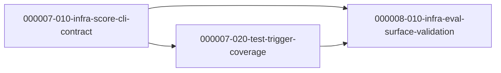
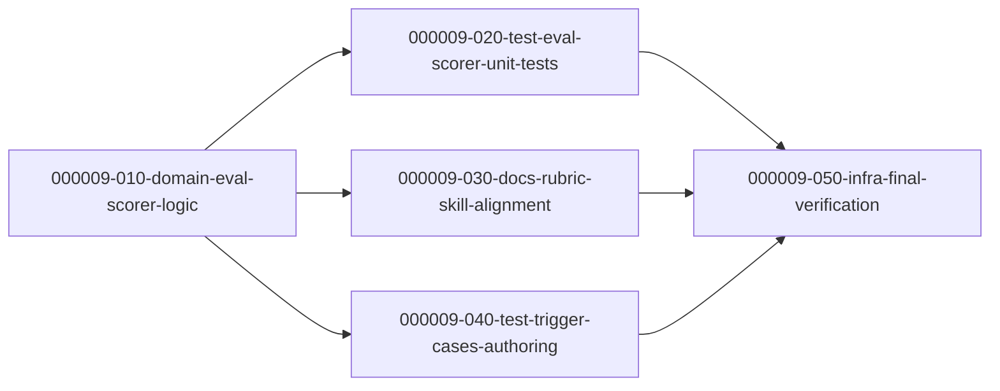
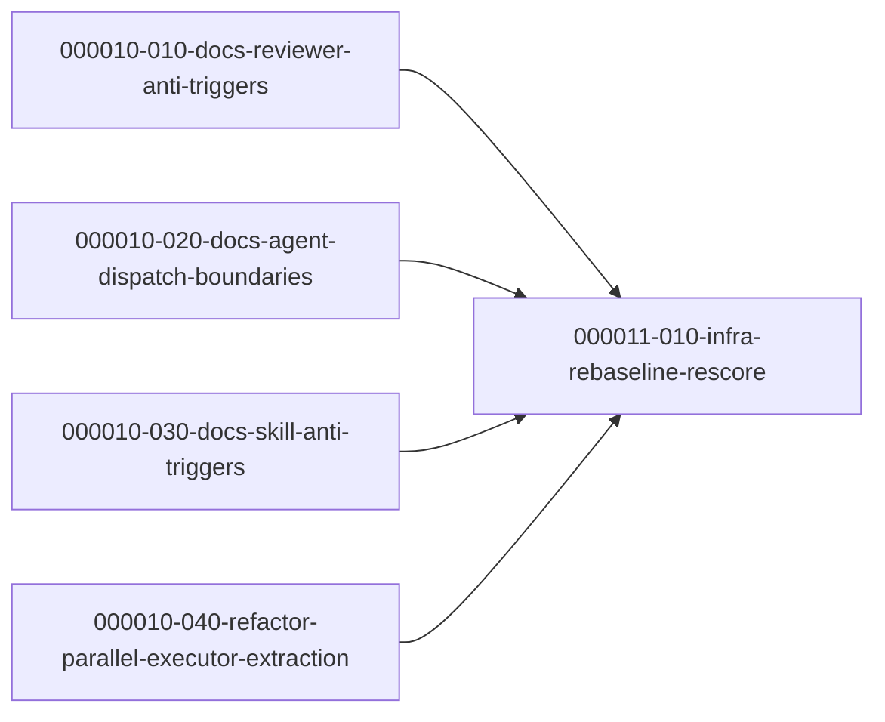

# Task Dependency Graph

## Batch

- Spec: `docs/ywc-plans/codex-toolkit-eval-improvements.md`
- Granularity mode: `llm`
- Starting phase: `000007`
- Rationale: existing completed tasks go through phase `000006`, so this batch starts at `000007`.

## Phase 000007 - Internal Evaluator Behavior

- `000007-010-infra-score-cli-contract` -> root
- `000007-020-test-trigger-coverage` -> depends on `000007-010-infra-score-cli-contract`

## Phase 000008 - Documentation Surface and Final Gate

- `000008-010-infra-eval-surface-validation` -> depends on `000007-010-infra-score-cli-contract`, `000007-020-test-trigger-coverage`

## Parallel Execution Notes

- Initial ready set: `000007-010-infra-score-cli-contract`
- After `000007-010-infra-score-cli-contract` merges: `000007-020-test-trigger-coverage` becomes runnable.
- After all Phase `000007` tasks merge: `000008-010-infra-eval-surface-validation` becomes runnable.
- `000007-010` and `000007-020` must not run in parallel because both may edit `tools/codex-internal/skills/ywc-codex-toolkit-eval/scripts/test_score.py`.
- `000008-010` must wait for both predecessors because it documents and validates their final behavior.

## Visual Dependency Graph

---

## Batch 2 — ywc-toolkit-eval (Claude Code) Quality Improvements

- Spec: `docs/ywc-plans/ywc-toolkit-eval-improvements.md`
- Granularity mode: `llm` · Language: korean
- Starting phase: `000009` (phases `000007`–`000008` are occupied by the codex batch above)
- Independent of the codex batch — no cross-dependency.

### Phase 000009 - Eval Scorer Fixes, Docs Alignment, Case Coverage

| Task | Category | Depends On |
| --- | --- | --- |
| `000009-010-domain-eval-scorer-logic` | domain | (root) |
| `000009-020-test-eval-scorer-unit-tests` | test | `000009-010` |
| `000009-030-docs-rubric-skill-alignment` | docs | `000009-010` |
| `000009-040-test-trigger-cases-authoring` | test | `000009-010` |
| `000009-050-infra-final-verification` | infra | `000009-010`, `-020`, `-030`, `-040` |

### Parallel Execution Notes (Batch 2)

- Initial ready set: `000009-010-domain-eval-scorer-logic` (solo — owns `score.py` + `history.mechanical.json`, atomic rebaseline).
- After `000009-010` merges: `000009-020`, `000009-030`, `000009-040` are parallel-safe (disjoint files: `test_score.py` / docs+rubric / `trigger-cases.json`).
- `000009-050` waits for all four; verification only (no source edits).
- **Hard gate (Spec Amendment A3):** `000009-010`'s A5/A7 logic change and the `history.mechanical.json` rebaseline must land in the **same commit**, or CI (`validate.yml --ci`) may go red.

---

## Batch 3 — ywc-toolkit Activation & Boundary Fixes (Claude catalog)

- Spec: `docs/ywc-plans/ywc-toolkit-activation-fixes.md` (spec-ready DONE, 2 iterations)
- Granularity mode: `llm` · Language: korean
- Starting phase: `000010` (phases `000007`–`000009` occupied by prior batches)
- Independent of prior batches — no cross-dependency. Targets `claude-code/agents` + `claude-code/skills` descriptions only (Codex mirror deferred).

### Phase 000010 — Description / Structure Edits

| Task | Category | Depends On |
| --- | --- | --- |
| `000010-010-docs-reviewer-anti-triggers` | docs | (root) |
| `000010-020-docs-agent-dispatch-boundaries` | docs | (root) |
| `000010-030-docs-skill-anti-triggers` | docs | (root) |
| `000010-040-refactor-parallel-executor-extraction` | refactor | (root) |

### Phase 000011 — Re-baseline & Re-score (hard gate)

| Task | Category | Depends On |
| --- | --- | --- |
| `000011-010-infra-rebaseline-rescore` | infra | `000010-010`, `-020`, `-030`, `-040` |

### Parallel Execution Notes (Batch 3)

- Initial ready set: `000010-010`, `000010-020`, `000010-030`, `000010-040` are **all parallel-safe** — each owns a disjoint set of files (3 reviewer agents / qa+doc agents / 4 skill SKILL.md / parallel-executor skill). No inter-task dependency within Phase 000010.
- None of the Phase 000010 tasks edit `history.mechanical.json`; each verifies read-only with `score.py --format json` (NOT `--ci`).
- **Hard gate:** `000011-010` waits for all four Phase 000010 tasks to merge, then runs the single `score.py --ci` re-baseline + full `ywc-toolkit-eval` re-score. Re-baselining before all edits land would produce an incomplete baseline.
- FR mapping: FR1→010, FR2+FR3→020, FR4–FR7→030, FR8→040, FR9→000011-010.

