# Task Dependency Graph

## Batch

- Spec: `docs/ywc-plans/codex-toolkit-eval-improvements.md`
- Granularity mode: `llm`
- Starting phase: `000007`
- Rationale: existing completed tasks go through phase `000006`, so this batch starts at `000007`.

## Phase 000007 - Internal Evaluator Behavior

- `000007-010-infra-score-cli-contract` -> root
- `000007-020-test-trigger-coverage` -> depends on `000007-010-infra-score-cli-contract`

## Phase 000008 - Documentation Surface and Final Gate

- `000008-010-infra-eval-surface-validation` -> depends on `000007-010-infra-score-cli-contract`, `000007-020-test-trigger-coverage`

## Parallel Execution Notes

- Initial ready set: `000007-010-infra-score-cli-contract`
- After `000007-010-infra-score-cli-contract` merges: `000007-020-test-trigger-coverage` becomes runnable.
- After all Phase `000007` tasks merge: `000008-010-infra-eval-surface-validation` becomes runnable.
- `000007-010` and `000007-020` must not run in parallel because both may edit `tools/codex-internal/skills/ywc-codex-toolkit-eval/scripts/test_score.py`.
- `000008-010` must wait for both predecessors because it documents and validates their final behavior.

## Visual Dependency Graph

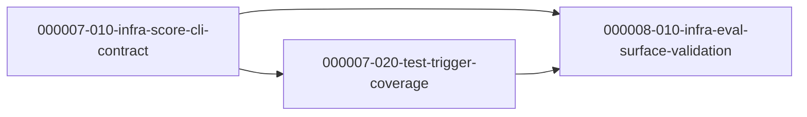

---

## Batch 2 — ywc-toolkit-eval (Claude Code) Quality Improvements

- Spec: `docs/ywc-plans/ywc-toolkit-eval-improvements.md`
- Granularity mode: `llm` · Language: korean
- Starting phase: `000009` (phases `000007`–`000008` are occupied by the codex batch above)
- Independent of the codex batch — no cross-dependency.

### Phase 000009 - Eval Scorer Fixes, Docs Alignment, Case Coverage

| Task | Category | Depends On |
| --- | --- | --- |
| `000009-010-domain-eval-scorer-logic` | domain | (root) |
| `000009-020-test-eval-scorer-unit-tests` | test | `000009-010` |
| `000009-030-docs-rubric-skill-alignment` | docs | `000009-010` |
| `000009-040-test-trigger-cases-authoring` | test | `000009-010` |
| `000009-050-infra-final-verification` | infra | `000009-010`, `-020`, `-030`, `-040` |

### Parallel Execution Notes (Batch 2)

- Initial ready set: `000009-010-domain-eval-scorer-logic` (solo — owns `score.py` + `history.mechanical.json`, atomic rebaseline).
- After `000009-010` merges: `000009-020`, `000009-030`, `000009-040` are parallel-safe (disjoint files: `test_score.py` / docs+rubric / `trigger-cases.json`).
- `000009-050` waits for all four; verification only (no source edits).
- **Hard gate (Spec Amendment A3):** `000009-010`'s A5/A7 logic change and the `history.mechanical.json` rebaseline must land in the **same commit**, or CI (`validate.yml --ci`) may go red.

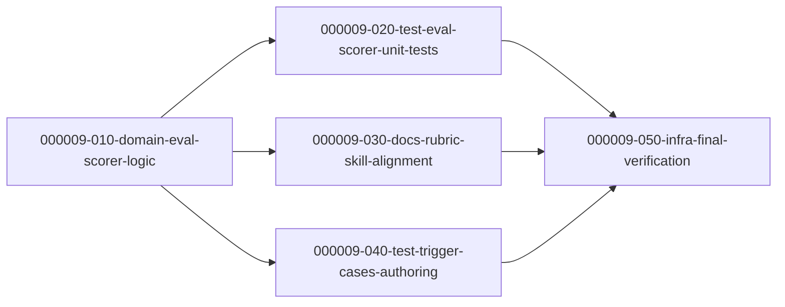

---

## Batch 3 — ywc-toolkit Activation & Boundary Fixes (Claude catalog)

- Spec: `docs/ywc-plans/ywc-toolkit-activation-fixes.md` (spec-ready DONE, 2 iterations)
- Granularity mode: `llm` · Language: korean
- Starting phase: `000010` (phases `000007`–`000009` occupied by prior batches)
- Independent of prior batches — no cross-dependency. Targets `claude-code/agents` + `claude-code/skills` descriptions only (Codex mirror deferred).

### Phase 000010 — Description / Structure Edits

| Task | Category | Depends On |
| --- | --- | --- |
| `000010-010-docs-reviewer-anti-triggers` | docs | (root) |
| `000010-020-docs-agent-dispatch-boundaries` | docs | (root) |
| `000010-030-docs-skill-anti-triggers` | docs | (root) |
| `000010-040-refactor-parallel-executor-extraction` | refactor | (root) |

### Phase 000011 — Re-baseline & Re-score (hard gate)

| Task | Category | Depends On |
| --- | --- | --- |
| `000011-010-infra-rebaseline-rescore` | infra | `000010-010`, `-020`, `-030`, `-040` |

### Parallel Execution Notes (Batch 3)

- Initial ready set: `000010-010`, `000010-020`, `000010-030`, `000010-040` are **all parallel-safe** — each owns a disjoint set of files (3 reviewer agents / qa+doc agents / 4 skill SKILL.md / parallel-executor skill). No inter-task dependency within Phase 000010.
- None of the Phase 000010 tasks edit `history.mechanical.json`; each verifies read-only with `score.py --format json` (NOT `--ci`).
- **Hard gate:** `000011-010` waits for all four Phase 000010 tasks to merge, then runs the single `score.py --ci` re-baseline + full `ywc-toolkit-eval` re-score. Re-baselining before all edits land would produce an incomplete baseline.
- FR mapping: FR1→010, FR2+FR3→020, FR4–FR7→030, FR8→040, FR9→000011-010.

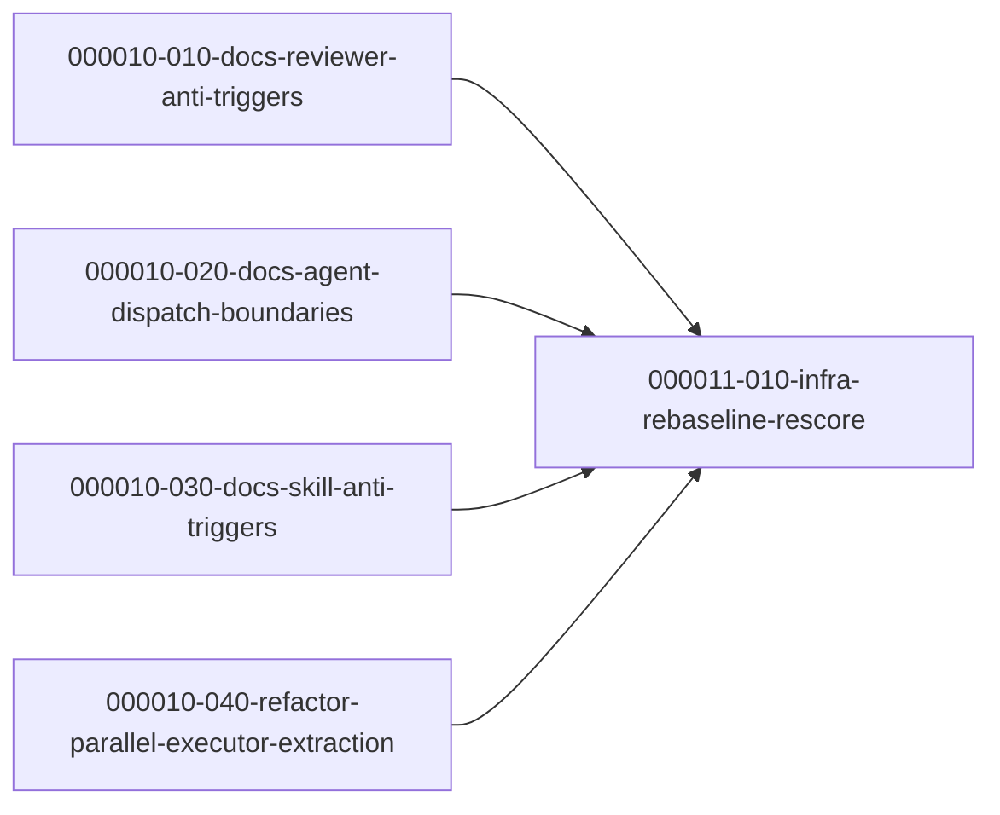

---

## Batch 4 — Codex Executor Contract-First / Test-First Skill Improvements

- Spec: `docs/ywc-plans/codex-executor-tdd-deep-module-gray-box.md`
- Granularity mode: `llm` · Language: korean
- Starting phase: `000012` (phases `000001`–`000011` occupied by existing/completed batches)
- Codex-only boundary: targets `codex/skills/**` source and generated plugin sync only; no `claude-code/**` edits.

### Phase 000012 — Shared Contract + Skill Surface Updates

| Task | Category | Depends On |
| --- | --- | --- |
| `000012-010-docs-shared-tdd-boundary-contract` | docs | (root) |
| `000012-020-docs-code-gen-contract-first` | docs | `000012-010` |
| `000012-030-docs-sequential-executor-test-first` | docs | `000012-010` |
| `000012-040-docs-parallel-executor-contract-gates` | docs | `000012-010` |

### Phase 000013 — Sync and Validation Hard Gate

| Task | Category | Depends On |
| --- | --- | --- |
| `000013-010-infra-codex-executor-contract-validation` | infra | `000012-010`, `-020`, `-030`, `-040` |

### Parallel Execution Notes (Batch 4)

- Initial ready set: `000012-010-docs-shared-tdd-boundary-contract`.
- After `000012-010` merges: `000012-020`, `000012-030`, and `000012-040` are parallel-safe because they own disjoint skill directories.
- `000013-010` waits for all Phase 000012 tasks, then runs install scan, optional generated plugin sync, and full repository validation.
- Conflict notes: the three skill tasks share only the new reference semantics and README localization expectations. They must not edit each other's skill directories.
- Hard boundary: no `claude-code/**` edits in Batch 4. Generated plugin output, if needed, belongs only to `000013-010`.
- FR mapping: FR-1→000012-010, FR-2→000012-020, FR-3→000012-030, FR-4→000012-040, FR-5→all Phase 000012 tasks, FR-6→000013-010.

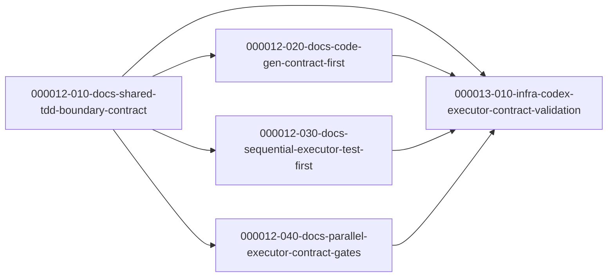

## Batch 5 — Claude Code Executor TDD / Deep Module / Gray Box Improvements

- Spec: `docs/ywc-plans/claude-code-executor-tdd-deep-module-gray-box.md`
- Granularity mode: `llm`
- Starting phase: `000014` (phases `000001`–`000013` occupied by existing/completed batches)
- Scope: claude-code only (the codex twin is Batch 4, phases `000012`–`000013`).

### Phase 000014 — Shared Reference + Skill Surface Updates

| Task | Category | Depends On |
|---|---|---|
| `000014-010-docs-shared-tdd-boundary-contract` | docs | (root) |
| `000014-020-docs-code-gen-red-gate-deep-module` | docs | `000014-010` |
| `000014-030-docs-sequential-executor-test-first` | docs | `000014-010` |
| `000014-040-docs-parallel-executor-contract-gates` | docs | `000014-010` |

### Phase 000015 — Validation Hard Gate

| Task | Category | Depends On |
|---|---|---|
| `000015-010-infra-claude-executor-contract-validation` | infra | `000014-010`, `-020`, `-030`, `-040` |

### Parallel Execution Notes (Batch 5)

- Initial ready set: `000014-010-docs-shared-tdd-boundary-contract`.
- After `000014-010` merges: `000014-020`, `000014-030`, `000014-040` are parallel-safe — each owns a disjoint `claude-code/skills/<skill>/` directory and only read-links the shared reference.
- `000015-010` is a **hard gate**: it waits for all four Phase 000014 tasks, then runs install scan + `scripts/validate.sh` + markdownlint and asserts the claude-code-only boundary.
- Hard boundary: no `codex/**` or `plugins/**` edits in Batch 5. The TDD-default divergence from Batch 4 (codex) is intentional and recorded in the spec.
- FR mapping: FR-1→000014-010, FR-2→000014-020, FR-3→000014-030, FR-4→000014-040, FR-5→all Phase 000014 tasks, FR-6→000015-010.

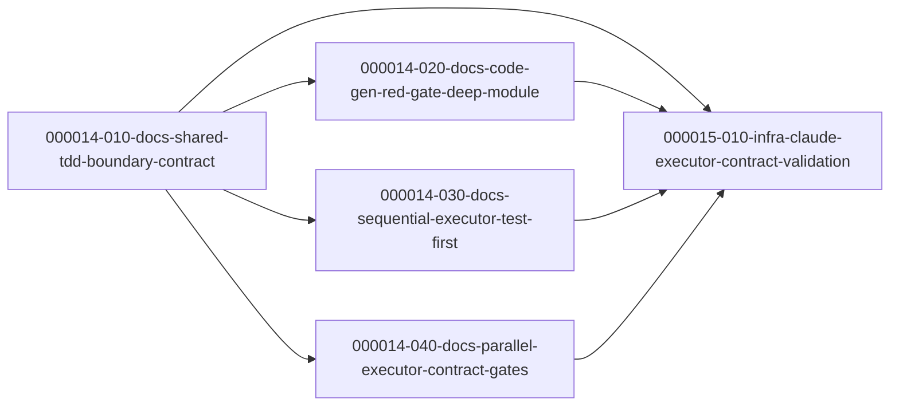

---

## Batch 6 — Codex Karpathy Guideline Integration

- Spec: `docs/ywc-plans/codex-karpathy-guideline-integration.md`
- Granularity mode: `llm` · Language: korean
- Starting phase: `000016` (phases `000001`–`000015` occupied by existing/completed batches)
- Scope: Codex skills and Codex custom agents only. Generated plugin package updates happen only through `bash scripts/sync-codex-plugin.sh`.
- Advisor pass: skipped because current tool policy allows subagent spawning only when the user explicitly requests delegation/subagents; local Pattern C phase review was applied instead.

### Phase 000016 — Source Guidance Updates

| Task | Category | Depends On |
|---|---|---|
| `000016-010-docs-principles-guideline-gap` | docs | (root) |
| `000016-020-docs-code-gen-worker-discipline` | docs | `000016-010` |
| `000016-030-docs-task-template-goal-verification` | docs | `000016-010` |
| `000016-040-docs-skill-author-future-proofing` | docs | `000016-010` |
| `000016-050-docs-custom-agent-bounded-evidence` | docs | `000016-010` |

### Phase 000017 — Sync and Validation Hard Gate

| Task | Category | Depends On |
|---|---|---|
| `000017-010-infra-codex-karpathy-validation` | infra | `000016-010`, `-020`, `-030`, `-040`, `-050` |

### Parallel Execution Notes (Batch 6)

- Initial ready set: `000016-010-docs-principles-guideline-gap`.
- After `000016-010` merges: `000016-020`, `000016-030`, `000016-040`, and `000016-050` are parallel-safe because they own disjoint source areas.
- `000017-010` is a hard gate. It waits for all Phase `000016` tasks, then runs plugin sync, full repository validation, Codex skill list, Codex agent list, targeted `rg`, and final diff scope checks.
- Conflict notes: `000016-020`, `000016-030`, and `000016-040` may each edit skill-local evals but not each other's skill directories. `000016-050` edits `codex/agents/**`, which is not synced into the plugin package.
- Hard boundary: no `claude-code/**` edits, no new `karpathy-*` skill/agent, and no manual edits to `plugins/ywc-agent-toolkit/skills/**`.
- FR mapping: FR-1→000016-010, FR-2→000016-020, FR-3→000016-030, FR-4→000016-040, FR-5→000016-050, FR-6→000016-020/030/040, FR-7→000017-010.

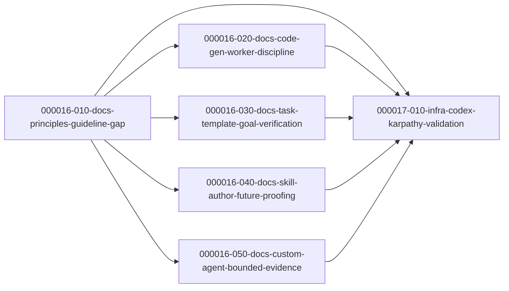

## Batch 7

- Spec: `docs/ywc-plans/claude-code-karpathy-guideline-integration.md` (DONE after spec-ready Iteration 2; Operative Sections → §Iteration 1 Amendments §A10)
- Granularity mode: `llm`
- Starting phase: `000018`
- Rationale: Codex Karpathy batch occupies `000016-010..050` + `000017-010` (active). Claude Code batch starts at `000018` to avoid collision.
- Scope: Claude Code skills/agents only. No `codex/**`, no product code, no new `karpathy-*` skill/agent.

### Phase 000018 — Karpathy Discipline Integration (foundation + parallel per-skill)

| Task | Category | Depends On |
|---|---|---|
| `000018-010-docs-principles-foundation` | docs | (root) |
| `000018-020-docs-planning-discipline` | docs | `000018-010` |
| `000018-030-docs-task-generator-goal-evals` | docs | `000018-010` |
| `000018-040-docs-surgical-simplicity-detection` | docs | `000018-010` |
| `000018-050-docs-execution-discipline` | docs | `000018-010` |

### Phase 000019 — Validation Hard Gate

| Task | Category | Depends On |
|---|---|---|
| `000019-010-infra-karpathy-validation` | infra | `000018-010`, `-020`, `-030`, `-040`, `-050` |

### Parallel Execution Notes (Batch 7)

- Initial ready set: `000018-010-docs-principles-foundation` (foundation; establishes canonical principle names in `references/principles.md`).
- After `000018-010` merges: `000018-020`, `000018-030`, `000018-040`, `000018-050` are parallel-safe — disjoint Ownership across distinct skill/agent subtrees.
- `000019-010` is a hard gate: waits for all Phase `000018`, then runs the §A5 extended `rg`, `validate.sh`, `install.sh --list --cc`, `--list --cc-agents`, and the `git diff --name-only` scope-boundary check.
- Conflict notes: the four Phase 000018 parallel tasks own disjoint areas — 020 owns spec-validate/plan/spec-writer; 030 owns task-generator (incl. evals); 040 owns impl-review + 3 language reviewers + code-gen; 050 owns parallel/sequential executors + debug-rootcause + root-cause-analyst. None overlaps. All four only *read* `references/principles.md` (edited solely by 010).
- Hard boundary: no `codex/**` edits, no new `karpathy-*` skill/agent, README sync only for the §A7 user-surface list (task-generator, spec-validate, plan, spec-writer, parallel-executor, code-gen).
- FR mapping: FR-1→000018-010, FR-2/FR-3→000018-020, FR-4/FR-12→000018-030, FR-5/FR-7→000018-040, FR-6/FR-8/FR-9/FR-10→000018-050, FR-11→000019-010.

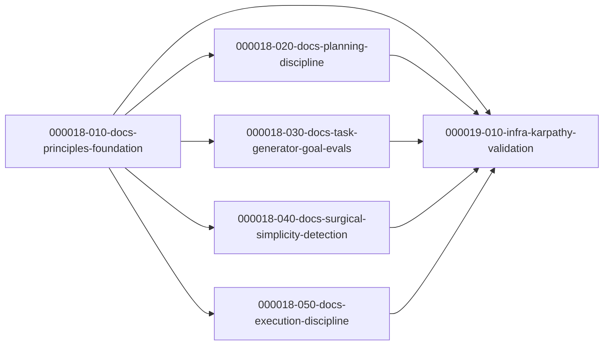

---

## Batch 8 — Codex Eval Quality Improvement Cycle

- Spec: `docs/ywc-plans/codex-eval-quality-improvement-cycle.md`
- Granularity mode: `llm`
- Starting phase: `000020`
- Scope: Codex eval report/scoreboard, selected Codex skill wording/eval fixtures, Codex agent A8 evidence strategy, generated plugin sync and validation.
- Hard boundary: no `.claude/**`, no `claude-code/**`, no product code, no dependency churn, and no manual edits to generated plugin output before `bash scripts/sync-codex-plugin.sh`.

### Phase 000020 — Evidence and Targeted Quality Improvements

| Task | Category | Depends On |
|---|---|---|
| `000020-010-docs-codex-eval-judgment-report` | docs | (root) |
| `000020-020-docs-codex-eval-scoreboard-update` | docs | `000020-010` |
| `000020-030-docs-runtime-fit-wording-polish` | docs | `000020-010` |
| `000020-040-test-eval-fixture-coverage` | test | `000020-010` |
| `000020-050-docs-agent-behavioral-evidence` | docs | `000020-010` |

### Phase 000021 — Sync and Validation Hard Gate

| Task | Category | Depends On |
|---|---|---|
| `000021-010-infra-codex-eval-sync-validation` | infra | `000020-010`, `-020`, `-030`, `-040`, `-050` |

### Parallel Execution Notes (Batch 8)

- Initial ready set: `000020-010-docs-codex-eval-judgment-report`.
- After `000020-010` merges: `000020-020`, `000020-030`, `000020-040`, and `000020-050` are parallel-safe by primary ownership, with the caveat that `000020-040` and `000020-050` may append bounded notes to the 2026-06-18 report and must merge after the report exists.
- `000020-030` and `000020-040` may both touch the `ywc-finish-branch` skill directory, but they own different files (`SKILL.md` vs `evals/evals.json`).
- `000021-010` is a hard gate: it waits for all Phase `000020` tasks, then runs plugin sync, repository validation, Codex install scans, evaluator CI, and final diff scope checks.
- FR mapping: FR-1→000020-010, FR-2→000020-020, FR-3→000020-030, FR-4→000020-040, FR-5→000020-050, FR-6→000021-010.

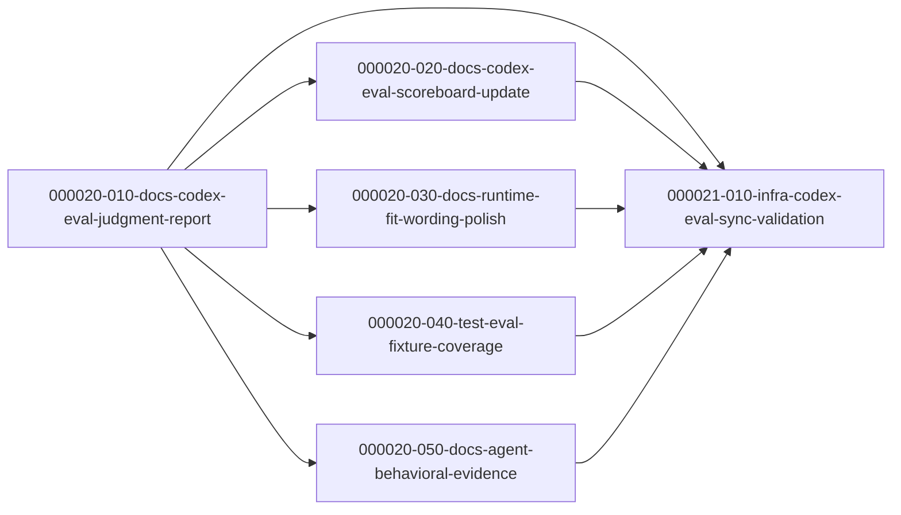

---

## Batch 9 — Toolkit-Eval Mechanical-Tier Fixes

- Spec: `plan.md` (converged via ywc-spec-ready, DONE; see `## Iteration 1 Amendments`)
- Granularity mode: `llm`
- Starting phase: `000022`
- Scope: 3 confirmed mechanical-tier skill defects (ywc-commit A4, ywc-spec-validate A2, ywc-gen-testcase A8) + eval baseline regeneration. Bundled as one llm vertical slice.
- Hard boundary: only the 3 named distributed skills + their references + `history.mechanical.json`; no other skills, no product code.

### Phase 000022 — Mechanical Findings + Baseline

| Task | Category | Depends On |
|---|---|---|
| `000022-010-docs-toolkit-eval-mechanical-fixes` | docs | (root) |

- FR mapping: FR1→ywc-commit A4, FR2→ywc-spec-validate A2, FR3→ywc-gen-testcase A8 extraction, FR4→baseline regen (intra-task final step, depends on FR1–FR3).

### Parallel Execution Notes (Batch 9)

- Single task, single phase — no intra-batch parallelism. FR4's dependency on FR1–FR3 is handled as ordered steps inside the task.
- Independent of Batch 8 (000020–000021): that batch's hard boundary excludes `.claude/**` and `claude-code/**`, so no shared-surface conflict on `history.mechanical.json` in practice.

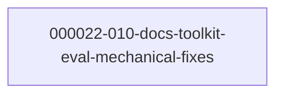

---

## Batch 10 — Codex Agent and Skill Eval Harness Improvements

- Spec: `docs/ywc-plans/codex-agent-skill-eval-harness-improvements.md`
- Spec ready log: `docs/ywc-plans/codex-agent-skill-eval-harness-improvements.spec-ready-log.md`
- Granularity mode: `llm` · Language: english
- Starting phase: `000023`
- Scope: Codex custom-agent smoke harness/evidence, missing Codex skill eval fixtures, selected Codex skill output-contract/progressive-disclosure cleanup, final Codex evaluation report and scoreboard update.
- Hard boundary: no Claude Code skills or agents, no product code, no dependency churn, no live LLM/API/runtime invocation from the validator, and no manual edits to generated plugin output before `bash scripts/sync-codex-plugin.sh`.
- Advisor pass: skipped. The skill's Pattern C advisor is optional, and current tool policy allows sub-agent spawning only when the user explicitly requests delegation/subagents; local phase-boundary review was applied instead.

### Phase 000023 — Harness, Evidence, Fixtures, and Skill Contracts

| Task | Category | Depends On |
|---|---|---|
| `000023-010-infra-agent-smoke-harness` | infra | (root) |
| `000023-020-test-agent-smoke-evidence` | test | `000023-010` |
| `000023-030-test-skill-eval-fixtures` | test | (root) |
| `000023-040-docs-codex-skill-contracts` | docs | `000023-030` |

### Phase 000024 — Final Evaluation Publication

| Task | Category | Depends On |
|---|---|---|
| `000024-010-docs-eval-report-scoreboard` | docs | `000023-010`, `000023-020`, `000023-030`, `000023-040` |

### Parallel Execution Notes (Batch 10)

- Initial ready set: `000023-010-infra-agent-smoke-harness`, `000023-030-test-skill-eval-fixtures`.
- After `000023-010` merges: `000023-020-test-agent-smoke-evidence` becomes runnable.
- After `000023-030` merges: `000023-040-docs-codex-skill-contracts` becomes runnable.
- `000023-030` and `000023-040` must not run in parallel because both touch Codex skill source directories and generated plugin sync surfaces.
- `000023-010` and `000023-030` are parallel-safe: the former owns internal evaluator scripts; the latter owns selected skill eval files and generated counterparts.
- `000023-020` and `000023-040` are parallel-safe after their respective predecessors merge: one owns agent smoke fixture/output evidence, the other owns Codex skill contract/progressive-disclosure edits.
- Phase `000024` is a hard gate. `000024-010` starts only after all Phase `000023` tasks are complete, because report and scoreboard movement require the full evidence set.
- FR mapping: FR-1/FR-3/FR-4/FR-5→`000023-010`, FR-1/FR-2→`000023-020`, FR-6→`000023-030`, FR-7/FR-8→`000023-040`, FR-9/FR-10→`000024-010`.

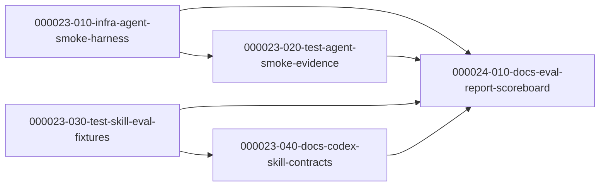

---

## Batch 11 — Tier 2: Harness-Feedback Loop & Mission Persistence

- Spec: `docs/ywc-plans/tier2-harness-feedback-and-mission-persistence.md`
- Spec ready log: `docs/ywc-plans/tier2-harness-feedback-and-mission-persistence.spec-ready-log.md`
- Granularity mode: `llm` · Language: english · Starting phase: `000025`
- Scope: harness-improvement feedback loop (debug-rootcause / incident-postmortem emit systemic-prevention into ywc-review-learnings via `--source debug|incident`) and stateful mission persistence (new `ywc-project-mission` skill + `docs/project-mission.md`, read by ywc-plan, written from ywc-brainstorm).
- Hard boundary: claude-code bundle only (no codex mirroring), markdown skill/doc edits only (no product code, no DB migration, no library introduction), propose+1-confirm apply mode.
- Advisor pass: skipped (Pattern C optional; phase boundary obvious, exactly two feature areas).
- No-AC requirements: none — every FR has a backing Acceptance Criterion.

### Phase 000025 — Foundations + Consumer Integrations (intra-phase deps via Depends On)

| Task | Category | Depends On |
|---|---|---|
| `000025-010-docs-review-learnings-prevention-sources` | docs | (root) |
| `000025-020-docs-project-mission-skill` | docs | (root) |
| `000025-030-docs-rootcause-postmortem-prevention-emit` | docs | `000025-010` |
| `000025-040-docs-mission-brainstorm-plan-integration` | docs | `000025-020` |

### Phase 000026 — Catalog & Conventions Finalization (hard gate)

| Task | Category | Depends On |
|---|---|---|
| `000026-010-docs-catalog-claude-md-integration` | docs | `000025-010`, `000025-020`, `000025-030`, `000025-040` |

### Parallel Execution Notes (Batch 11)

- Initial ready set: `000025-010` and `000025-020` — disjoint ownership, parallel-safe.
- `000025-030` runnable after `000025-010` merges (needs `--source debug|incident`); `000025-040` runnable after `000025-020` merges (needs `ywc-project-mission`). `000025-030` and `000025-040` are parallel-safe (disjoint ownership).
- Phase-gate placement: `000025-030`/`000025-040` each depend on only ONE Phase 000025 task, so per the phase-gate rule they live in Phase 000025 (ordered via Depends On), not a separate phase.
- Phase `000026` is a true hard gate: `000026-010` edits shared `claude-code/skills/README.md` + `CLAUDE.md` and starts only after ALL Phase 000025 tasks merge.
- FR mapping: FR3→`000025-010`, FR4→`000025-020`, FR1/FR2→`000025-030`, FR5/FR6→`000025-040`, FR7/AC11→`000026-010`.

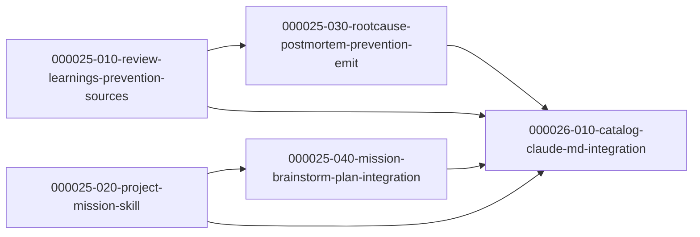

---

## Batch 12 — develop-with-llm PR 132/133/134/140 Codex Port

- Spec: `docs/ywc-plans/develop-with-llm-pr132-133-134-140-codex-port.md`
- Spec ready log: `docs/ywc-plans/develop-with-llm-pr132-133-134-140-codex-port.spec-ready-log.md`
- Granularity mode: `llm` · Language: korean · Starting phase: `000027`
- Scope: Codex source skills, Codex eval fixtures, and generated plugin sync only. No `claude-code/**` or `tools/codex-skill/**` edits.
- Advisor pass: skipped because phase boundaries are resolved by repository constraints: `codex/skills/` source changes first, generated plugin sync last.

### Phase 000027 — Codex Source Contracts, Guidance, Fixtures

| Task | Category | Depends On |
|---|---|---|
| `000027-010-refactor-plan-pr-spec-contracts` | refactor | (root) |
| `000027-020-refactor-pr-health-handler` | refactor | (root) |
| `000027-030-refactor-executor-health-sweeps` | refactor | `000027-020` |
| `000027-040-refactor-agent-context-compaction` | refactor | (root) |
| `000027-050-refactor-parity-doc-hygiene` | refactor | (root) |
| `000027-060-test-codex-parity-evals` | test | (root) |

### Phase 000028 — Generated Package and Validation Hard Gate

| Task | Category | Depends On |
|---|---|---|
| `000028-010-infra-plugin-sync-validation` | infra | `000027-010`, `000027-020`, `000027-030`, `000027-040`, `000027-050`, `000027-060` |

### Parallel Execution Notes (Batch 12)

- Initial ready set: `000027-010`, `000027-020`, `000027-040`, `000027-050`, and `000027-060` are parallel-safe because they own disjoint skill directories or eval files.
- After `000027-020` merges: `000027-030` becomes runnable because executor call sites depend on the final handler contract and helper name.
- `000028-010` is the final hard gate. It waits for all Phase `000027` tasks, then runs source checks, plugin sync, full validation, and Codex-only boundary verification.
- `000027-030` must not run in parallel with `000027-020`; the handler contract is its prerequisite.
- `000028-010` must not run in parallel with any Phase `000027` task because it owns generated plugin output for all source edits.

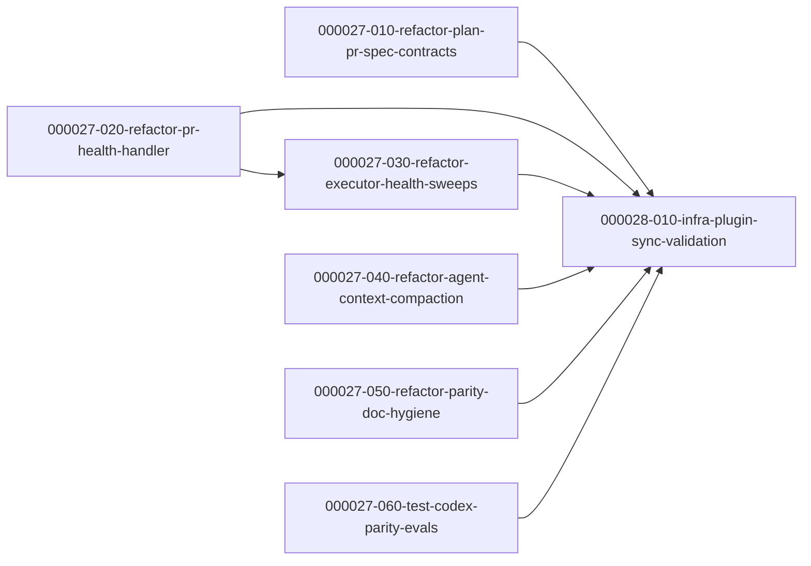

---

## Batch 13 — develop-with-llm PR 132/133/134/140 Claude Code Port

- Spec: `docs/ywc-plans/develop-with-llm-pr132-133-134-140-claude-code-port.md`
- Spec ready log: `docs/ywc-plans/develop-with-llm-pr132-133-134-140-claude-code-port.spec-ready-log.md`
- Granularity mode: `llm` · Language: korean · Starting phase: `000029`
- Scope: `claude-code/skills/**` only. The Codex twin is Batch 12 (phases `000027`–`000028`); no `codex/**` or `plugins/ywc-agent-toolkit/**` edits in this batch.
- Advisor pass: skipped — single dependency-free phase, mechanical per-skill grouping, no competing DB/library boundaries.
- No-AC requirements: none — every item traces to a backing PR change; eval/plugin-sync items are Codex-only and out of scope.

### Phase 000029 — Claude Code skill drift port (single phase, no inter-task deps)

| Task | Category | Depends On |
|---|---|---|
| `000029-010-refactor-plan-spec-contracts` | refactor | (root) |
| `000029-020-refactor-pr-health-handler` | refactor | (root) |
| `000029-030-refactor-executor-health-sweeps` | refactor | (root) |
| `000029-040-refactor-agent-context-compaction` | refactor | (root) |
| `000029-050-refactor-parity-doc-hygiene` | refactor | (root) |

- Task ↔ PR ↔ skill: 010 = #132 ywc-plan + #134 ywc-create-pr + #134/#140 ywc-spec-validate + #140 ywc-spec-writer; 020 = #133 ywc-handle-pr-reviews; 030 = #133 ywc-parallel-executor + #133/#134 ywc-sequential-executor; 040 = #134 ywc-agentic + ywc-onboard-repo; 050 = #140 ywc-gen-testcase + ywc-project-docs + ywc-project-scaffold + references/project-docs-structure.md.

### Parallel Execution Notes (Batch 13)

- Initial ready set: all five tasks — no dependencies (independent instruction/doc edits).
- Conflicts With: none. Each skill directory is owned by exactly one task. The two PR-double-touched skills are contained: `ywc-spec-validate` (#134+#140) wholly in `000029-010`; `ywc-sequential-executor` (#133+#134) wholly in `000029-030`.
- Shared Surfaces: none across tasks. All tasks share the `bash scripts/validate.sh` + markdownlint CI gates, so each must self-verify before merge.
- Hard boundary: no `codex/**` / `plugins/ywc-agent-toolkit/**` edits → pre-push hook stays green.
- Recommended execution: per the spec's single-branch intent, run `ywc-sequential-executor --local-merge` over 010→050 on one branch. Parallel worktree execution is also conflict-free.
- Adaptations from upstream (verified): 6 README locales here vs 4 upstream (add es/zh); `ywc-onboard-repo` es/zh do **not** exist → create; `ywc-agentic` README untouched (SKILL.md only); no `evals/` here (omit #140 eval additions); `ywc-gen-testcase` reference file has no `legalforce` URL (SKILL.md + READMEs only); `ywc-project-scaffold/SKILL.md` already has Rust/Axum (README-only).

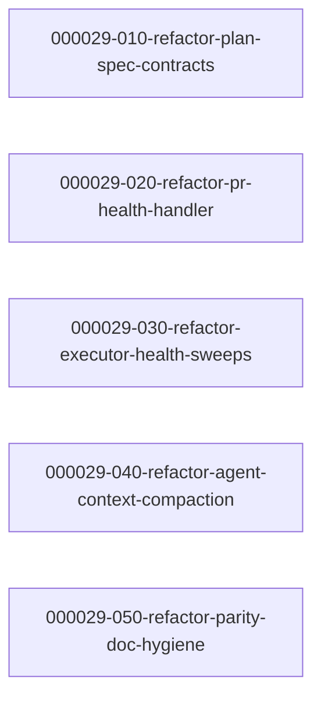
